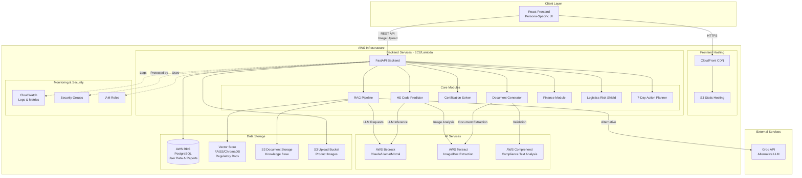

# Design Document: ExportSathi

## Overview

ExportSathi is an AI-powered Export Compliance & Certification Co-Pilot designed to help Indian MSMEs (Micro, Small, and Medium Enterprises) start exporting within 7 days. The platform addresses the "Liquidity-Compliance Trap" by providing comprehensive guidance on certifications, documentation, finance, and logistics without requiring expensive consultants or deep regulatory knowledge.

### Core Value Proposition

ExportSathi enables MSMEs to:
- **Predict HS codes** automatically from product images and descriptions
- **Identify required certifications** (FDA, CE, REACH, BIS, ZED, SOFTEX) for any product-market combination
- **Navigate certification processes** with step-by-step guidance, document checklists, and subsidy information
- **Auto-generate export documents** (invoices, packing lists, shipping bills, GST LUT, SOFTEX, certificates of origin)
- **Plan working capital** with RoDTEP calculations, pre-shipment credit eligibility, and cash flow timelines
- **Assess logistics risks** including LCL vs FCL decisions, RMS probability, and route delays
- **Follow a 7-day action plan** to become export-ready quickly

### System Architecture

The system follows a multi-tier architecture:

1. **Presentation Layer**: React-based web interface with persona-specific features for Manufacturing MSMEs, SaaS exporters, and Merchant exporters
2. **Application Layer**: Python FastAPI backend orchestrating multiple AI-powered modules
3. **AI Layer**: RAG pipeline with AWS Bedrock/Groq for LLM inference, AWS Textract for document extraction, AWS Comprehend for compliance text analysis
4. **Data Layer**: Vector store (FAISS/ChromaDB) for regulatory document retrieval, AWS RDS for user data and reports, AWS S3 for document storage
5. **Infrastructure Layer**: AWS services (EC2/Lambda, S3, RDS, Bedrock, Textract, Comprehend, CloudWatch)

### Core Workflow

1. **Product Input**: User uploads product image, enters details (name, BOM, ingredients), selects destination country and business type
2. **AI Analysis**: Backend processes image with Textract, predicts HS code, retrieves relevant regulations from knowledge base
3. **Export Readiness Report**: System generates comprehensive report with HS code, certifications, compliance roadmap, risks, costs, timeline, and risk score
4. **Certification Navigation**: User explores detailed guidance for each certification with document checklists, test labs, consultants, subsidies
5. **Document Generation**: System auto-generates all required export documents with AI validation
6. **Finance Planning**: User reviews working capital requirements, RoDTEP benefits, pre-shipment credit eligibility
7. **Logistics Assessment**: User evaluates LCL vs FCL options, RMS probability, freight costs
8. **7-Day Action Plan**: User follows day-by-day tasks to become export-ready
9. **Interactive Q&A**: User asks follow-up questions via chat interface with context preservation

All AI responses are grounded in retrieved regulatory documents from DGFT, Customs RMS rules, FDA refusal database, EU RASFF, GSTN, and RoDTEP schedules to ensure accuracy and prevent hallucinations.

## Architecture

### System Architecture Diagram



### Component Interactions

**1. Product Input and HS Code Prediction Flow:**
1. User fills form with product name, uploads image, enters BOM/ingredients, selects destination country and business type
2. Frontend sends POST request to `/api/reports/generate` with multipart form data (text fields + image file)
3. Backend uploads image to S3 upload bucket
4. Backend calls AWS Textract to extract text and visual features from product image
5. HS Code Predictor combines image analysis, product description, and BOM to predict HS code
6. HS Code Predictor queries LLM (Bedrock/Groq) with extracted features and retrieves similar products from knowledge base
7. System returns HS code prediction with confidence percentage
8. If confidence < 70%, system requests additional product information from user

**2. Export Readiness Report Generation Flow:**
1. Backend receives validated query with HS code prediction
2. RAG Pipeline constructs query combining product details, HS code, destination country, and business type
3. RAG Pipeline converts query to embedding vector
4. Vector Store returns top-k most similar regulatory documents (DGFT, FDA, EU RASFF, Customs RMS)
5. Backend constructs comprehensive prompt with retrieved documents as context
6. LLM generates structured Export Readiness Report with sections:
   - HS code prediction with confidence
   - Required certifications (FDA, CE, REACH, BIS, ZED, SOFTEX, etc.)
   - Restricted substances and ingredients
   - Past rejection reasons from FDA/EU databases
   - Compliance roadmap with timeline
   - Risk score (0-100)
   - Estimated costs
   - Applicable subsidies
7. Backend validates response structure and stores report in RDS
8. Backend returns report to Frontend
9. Frontend renders report with interactive sections

**3. Certification Solver Flow:**
1. User clicks on a certification in the Export Readiness Report
2. Frontend sends POST request to `/api/certifications/{cert_id}/guidance`
3. Certification Solver retrieves certification-specific documents from knowledge base
4. System generates detailed guidance including:
   - Why certification is required
   - Step-by-step acquisition process
   - Required documents checklist
   - Approved test labs with contact info
   - Consultant marketplace options
   - Government subsidies (e.g., ZED 80% for micro enterprises)
   - Common rejection reasons
   - Cost range and timeline
   - Mock audit questions
5. Backend returns structured guidance
6. Frontend displays guidance in expandable section with document checklist
7. User can mark documents as complete (persisted to RDS)

**4. Smart Documentation Generation Flow:**
1. User navigates to Documentation section and selects document type
2. Frontend sends POST request to `/api/documents/generate` with document type and user data
3. Document Generator retrieves user's product details, certifications, and business info from RDS
4. System selects India-specific template for requested document type
5. Document Generator auto-fills template with user data
6. AWS Comprehend validates document for compliance text requirements
7. System performs AI validation checks:
   - Port code mismatch detection
   - Invoice format validation
   - GST vs Shipping Bill matching
   - RMS risk trigger detection (red flag keywords)
8. If validation errors found, system highlights errors and provides correction suggestions
9. Backend returns document in PDF and editable formats
10. Frontend displays document with validation status and download options
11. For SaaS exporters, system generates SOFTEX with proper service classification

**5. Finance Readiness Module Flow:**
1. User navigates to Finance section
2. Frontend sends GET request to `/api/finance/analysis` with report_id
3. Finance Module retrieves product details, certifications, and timeline from RDS
4. System calculates:
   - Total working capital requirements (product cost + certification costs + logistics + timeline buffer)
   - Pre-shipment credit eligibility based on company size and order value
   - RoDTEP benefit amount using HS code and destination country
   - GST refund timeline and amount
   - Currency hedging recommendations
5. System generates cash-flow timeline showing:
   - When expenses occur (certifications, production, logistics)
   - When refunds/payments expected (RoDTEP, GST refund, customer payment)
   - Liquidity gap period identification
6. System suggests financing options and bank referral programs
7. Backend returns finance analysis
8. Frontend displays interactive cash-flow timeline and financing options

**6. Logistics Risk Shield Flow:**
1. User enters shipment details (volume, value, product description)
2. Frontend sends POST request to `/api/logistics/risk-analysis`
3. Logistics Risk Shield analyzes:
   - LCL vs FCL recommendation based on volume and product type
   - RMS probability estimation using product description, HS code, and historical data
   - Red flag keyword detection in product description
   - Route delay prediction based on geopolitical factors (e.g., Red Sea disruptions)
   - Freight cost estimation for different routes and carriers
   - Insurance coverage recommendations
4. System retrieves current shipping data and customs RMS rules from knowledge base
5. Backend returns risk analysis with recommendations
6. Frontend displays risk assessment with actionable recommendations

**7. 7-Day Action Plan Flow:**
1. Backend generates action plan as part of Export Readiness Report
2. System prioritizes tasks based on dependencies:
   - Day 1: GST LUT application, HS code confirmation
   - Day 2-3: Critical certification applications (FDA, CE if required)
   - Day 4-5: Document preparation (invoices, packing lists)
   - Day 6: Logistics planning and freight booking
   - Day 7: Final review and readiness check
3. System accounts for government processing times and flags certifications requiring >7 days
4. Frontend displays action plan with daily tasks
5. User can mark tasks as complete (persisted to RDS)
6. Frontend shows progress percentage and estimated export-ready date
7. User can download action plan as PDF checklist

**8. Chat Q&A Flow:**
1. User submits question via chat interface
2. Frontend sends POST request to `/api/chat` with question and session context
3. Backend retrieves conversation history and original query context from RDS
4. RAG Pipeline retrieves relevant documents for the question
5. Backend constructs prompt with conversation history, query context, and retrieved documents
6. LLM generates response with source citations
7. Backend stores message in conversation history (RDS)
8. Backend returns response with sources
9. Frontend displays response in chat interface with source links

**9. Persona-Specific Feature Routing:**
1. User selects business type during onboarding (Manufacturing/SaaS/Merchant)
2. Frontend stores business type in user profile
3. For Manufacturing MSMEs:
   - Emphasize certification guidance (CE, FDA, REACH, BIS)
   - Show HS code mapping and ingredient/BOM analysis
   - Highlight shipment rejection prevention
   - Display physical product labeling requirements
4. For SaaS/Service exporters:
   - Emphasize SOFTEX filing guidance
   - Show payment reconciliation (Stripe, PayPal)
   - Display service classification and GST on digital services
   - Highlight cross-border payment compliance
5. For Merchant exporters:
   - Emphasize LCL shipment risks
   - Show RMS check probability
   - Display customs broker selection guidance
   - Highlight re-export regulations
6. Backend tailors recommendations and document generation based on business type

### Technology Stack

**Frontend:**
- React 18+ with functional components and hooks
- TypeScript for type safety
- Axios for HTTP requests
- React Router for navigation
- Tailwind CSS for styling
- React Hook Form for form management
- React Query for server state management
- Local storage for checklist state persistence
- Chart.js or Recharts for finance timeline visualization

**Backend:**
- Python 3.10+
- FastAPI for REST API framework
- Pydantic for data validation and serialization
- LangChain for RAG pipeline orchestration
- Sentence Transformers for embedding generation (all-MiniLM-L6-v2 or all-mpnet-base-v2)
- FAISS or ChromaDB for vector storage
- Boto3 for AWS service integration (S3, Textract, Comprehend, Bedrock, RDS)
- SQLAlchemy for RDS database ORM
- Pillow for image preprocessing
- python-multipart for file upload handling
- Redis (optional) for session caching

**AI Services:**
- AWS Bedrock for LLM inference (Claude 3, Llama 3, or Mixtral models)
- Groq API as alternative LLM provider
- AWS Textract for image and document text extraction
- AWS Comprehend for compliance text analysis and entity extraction
- Sentence Transformers for embedding generation

**Data Storage:**
- AWS RDS PostgreSQL for:
  - User profiles and authentication
  - Export readiness reports
  - Certification progress tracking
  - Chat conversation history
  - Document generation history
  - Finance analysis data
  - 7-day action plan progress
- AWS S3 for:
  - Knowledge base documents (regulations, guides)
  - User-uploaded product images
  - Generated documents (PDFs)
  - Vector store backups
- FAISS or ChromaDB for vector embeddings

**Infrastructure:**
- AWS EC2 or AWS Lambda for backend hosting
- AWS S3 + CloudFront for frontend hosting
- AWS RDS for relational database
- AWS IAM for access control
- AWS CloudWatch for logging and monitoring
- AWS Security Groups for network security
- AWS Certificate Manager for SSL/TLS certificates

**Development Tools:**
- Docker for local development environment
- pytest for backend testing
- Hypothesis for property-based testing (Python)
- Jest and React Testing Library for frontend testing
- fast-check for property-based testing (TypeScript)
- GitHub Actions for CI/CD
- ESLint and Prettier for code formatting
- Black and isort for Python code formatting

## Components and Interfaces

### Frontend Components

**1. OnboardingForm Component**
- Purpose: Capture user business type and initial profile information
- Props: `onComplete: (profile: UserProfile) => void`
- State: `businessType: 'Manufacturing' | 'SaaS' | 'Merchant'`, `companySize: 'Micro' | 'Small' | 'Medium'`, `errors: ValidationErrors`
- Features: Business type selection, company size selection, monthly volume input
- Emits: Profile completion event to parent

**2. QueryForm Component**
- Purpose: Capture product input with image upload and destination
- Props: `onSubmit: (query: QueryInput) => void`, `businessType: BusinessType`
- State: `productName: string`, `productImage: File | null`, `ingredients: string`, `bom: string`, `destinationCountry: string`, `monthlyVolume: number`, `priceRange: string`, `paymentMode: string`, `errors: ValidationErrors`
- Validation: Product name required, image optional but recommended, destination required
- Features: Image upload with preview, ingredient/BOM text area, country autocomplete
- Emits: Query submission event with form data and image file

**3. ReportDisplay Component**
- Purpose: Render comprehensive export readiness report
- Props: `report: ExportReadinessReport`, `businessType: BusinessType`
- Sub-components: HSCodeSection, CertificationSection, ComplianceRoadmap, RisksSection, TimelineSection, CostBreakdown, SubsidiesSection, ActionPlanSection
- Features: Expandable sections, persona-specific highlighting
- Displays: Structured report with all sections

**4. HSCodeSection Component**
- Purpose: Display HS code prediction with confidence
- Props: `hsCode: string`, `confidence: number`, `alternativeCodes: HSCode[]`
- Features: Confidence indicator, alternative codes if confidence < 70%, manual override option
- Displays: HS code, confidence percentage, description, alternative suggestions

**5. CertificationSection Component**
- Purpose: List required certifications with navigation to detailed guidance
- Props: `certifications: Certification[]`, `onSelectCertification: (id: string) => void`
- Features: Certification cards with priority indicators, click to view details
- Displays: Certification name, type, mandatory/optional, estimated cost, timeline

**6. CertificationDetailModal Component**
- Purpose: Display detailed certification guidance
- Props: `certification: Certification`, `guidance: CertificationGuidance`, `onClose: () => void`
- Sub-components: DocumentChecklist, TestLabList, ConsultantMarketplace, SubsidyInfo, MockAuditQuestions
- Features: Document checklist with completion tracking, test lab contact info, consultant hiring
- Displays: Full certification acquisition roadmap

**7. DocumentChecklist Component**
- Purpose: Interactive checklist for certification documents
- Props: `documents: Document[]`, `onToggle: (id: string) => void`, `completedDocs: Set<string>`
- State: Persisted to RDS via API
- Features: Checkbox for each document, auto-fill assistance button
- Displays: Document name, description, status, auto-fill option

**8. ComplianceRoadmap Component**
- Purpose: Visual timeline of compliance steps
- Props: `roadmap: RoadmapStep[]`
- Features: Interactive timeline with dependencies, progress tracking
- Displays: Steps in chronological order with duration and dependencies

**9. RisksSection Component**
- Purpose: Display identified risks with mitigation strategies
- Props: `risks: Risk[]`, `riskScore: number`
- Features: Risk severity indicators, expandable mitigation details
- Displays: Risk cards with severity, description, mitigation

**10. ActionPlanSection Component**
- Purpose: Display and track 7-day action plan
- Props: `actionPlan: ActionPlan`, `onTaskToggle: (taskId: string) => void`
- State: Task completion status (persisted to RDS)
- Features: Daily task lists, progress bar, PDF download
- Displays: Day-by-day tasks with checkboxes, overall progress percentage

**11. DocumentationHub Component**
- Purpose: Central hub for document generation and management
- Props: `reportId: string`, `businessType: BusinessType`
- Sub-components: DocumentTypeSelector, DocumentPreview, ValidationResults
- Features: Document type selection, auto-generation, validation, download
- Displays: Available document types, generated documents, validation status

**12. DocumentGenerator Component**
- Purpose: Generate specific export document
- Props: `documentType: DocumentType`, `reportId: string`, `onGenerate: (doc: GeneratedDocument) => void`
- Features: Template selection, auto-fill, manual editing, validation
- Displays: Document form with auto-filled fields, validation errors, preview

**13. ValidationResults Component**
- Purpose: Display document validation results
- Props: `validationResults: ValidationResult[]`
- Features: Error highlighting, correction suggestions, re-validation
- Displays: Validation errors with severity, location, suggested fixes

**14. FinanceModule Component**
- Purpose: Display finance readiness analysis
- Props: `financeAnalysis: FinanceAnalysis`
- Sub-components: WorkingCapitalBreakdown, CashFlowTimeline, RoDTEPCalculator, FinancingOptions
- Features: Interactive cash flow timeline, financing option comparison
- Displays: Financial metrics, timeline visualization, financing recommendations

**15. CashFlowTimeline Component**
- Purpose: Visual timeline of cash inflows and outflows
- Props: `timeline: CashFlowEvent[]`
- Features: Interactive timeline with zoom, liquidity gap highlighting
- Library: Chart.js or Recharts
- Displays: Timeline with expenses (red) and income (green), liquidity gap periods

**16. LogisticsRiskShield Component**
- Purpose: Display logistics risk analysis
- Props: `riskAnalysis: LogisticsRiskAnalysis`
- Sub-components: LCLvsFCLComparison, RMSProbability, RouteAnalysis, FreightEstimator
- Features: Risk indicators, recommendation cards, freight comparison
- Displays: Risk assessment with actionable recommendations

**17. RMSProbability Component**
- Purpose: Display RMS check probability and risk factors
- Props: `rmsProbability: number`, `riskFactors: string[]`
- Features: Probability gauge, red flag keyword highlighting
- Displays: Probability percentage, identified risk factors, mitigation tips

**18. ChatInterface Component**
- Purpose: Q&A chat for follow-up questions
- Props: `sessionId: string`, `initialContext: QueryContext`
- State: `messages: ChatMessage[]`, `inputText: string`, `isLoading: boolean`
- Features: Message history, input field, send button, loading indicator, source citations
- Displays: Conversation with user and assistant messages, source links

**19. PersonaDashboard Component**
- Purpose: Persona-specific dashboard with relevant features
- Props: `businessType: BusinessType`, `userProfile: UserProfile`
- Features: Persona-specific widgets, quick actions, progress tracking
- For Manufacturing: Certification progress, HS code lookup, rejection prevention tips
- For SaaS: SOFTEX filing status, payment reconciliation, service classification
- For Merchant: LCL risk alerts, RMS probability, customs broker directory

**20. ProgressDashboard Component**
- Purpose: Display user's export readiness progress and metrics
- Props: `userId: string`, `metrics: UserMetrics`
- Features: Progress percentage, cost savings calculator, timeline to export-ready
- Displays: Progress bars, cost savings vs consultant fees, success metrics

**21. ErrorBoundary Component**
- Purpose: Catch and display React errors gracefully
- State: `hasError: boolean`, `error: Error | null`
- Displays: User-friendly error message with retry option

**22. LoadingSpinner Component**
- Purpose: Visual feedback during async operations
- Props: `message?: string`, `estimatedTime?: number`
- Displays: Spinner animation with optional status message and time estimate

### Backend Components

**1. API Router (`routers/reports.py`)**
- Endpoints:
  - `POST /api/reports/generate`: Generate export readiness report with image upload
  - `GET /api/reports/{report_id}`: Retrieve existing report
  - `GET /api/reports/{report_id}/status`: Check report generation status
  - `PUT /api/reports/{report_id}/hs-code`: Update HS code manually
- Dependencies: RAGPipeline, HSCodePredictor, ReportGenerator, ImageProcessor
- Validation: Pydantic models for request/response, file size limits
- Features: Multipart form data handling, async report generation

**2. API Router (`routers/certifications.py`)**
- Endpoints:
  - `GET /api/certifications`: List all supported certifications
  - `GET /api/certifications/{cert_id}`: Get certification details
  - `POST /api/certifications/{cert_id}/guidance`: Generate detailed guidance
  - `GET /api/certifications/{cert_id}/test-labs`: List approved test labs
  - `GET /api/certifications/{cert_id}/consultants`: List available consultants
  - `GET /api/certifications/{cert_id}/subsidies`: Get subsidy information
  - `PUT /api/certifications/{cert_id}/progress`: Update certification progress
- Dependencies: CertificationSolver, RAGPipeline
- Features: Certification marketplace integration, progress tracking

**3. API Router (`routers/documents.py`)**
- Endpoints:
  - `POST /api/documents/generate`: Generate export document
  - `GET /api/documents/types`: List available document types
  - `POST /api/documents/validate`: Validate document
  - `GET /api/documents/{doc_id}`: Retrieve generated document
  - `GET /api/documents/{doc_id}/download`: Download document as PDF
- Dependencies: DocumentGenerator, DocumentValidator, TemplateEngine
- Features: Document auto-generation, AI validation, PDF export

**4. API Router (`routers/finance.py`)**
- Endpoints:
  - `GET /api/finance/analysis/{report_id}`: Get finance readiness analysis
  - `POST /api/finance/rodtep-calculator`: Calculate RoDTEP benefits
  - `POST /api/finance/working-capital`: Calculate working capital requirements
  - `GET /api/finance/credit-eligibility`: Assess pre-shipment credit eligibility
  - `GET /api/finance/banks`: List bank referral programs
- Dependencies: FinanceModule, RoDTEPCalculator, CreditAssessor
- Features: Financial calculations, bank integrations

**5. API Router (`routers/logistics.py`)**
- Endpoints:
  - `POST /api/logistics/risk-analysis`: Analyze logistics risks
  - `POST /api/logistics/rms-probability`: Calculate RMS check probability
  - `POST /api/logistics/freight-estimate`: Estimate freight costs
  - `GET /api/logistics/routes`: Get available shipping routes
  - `POST /api/logistics/lcl-fcl-comparison`: Compare LCL vs FCL options
- Dependencies: LogisticsRiskShield, RMSPredictor, FreightEstimator
- Features: Risk assessment, cost estimation, route analysis

**6. API Router (`routers/action-plan.py`)**
- Endpoints:
  - `GET /api/action-plan/{report_id}`: Get 7-day action plan
  - `PUT /api/action-plan/{report_id}/tasks/{task_id}`: Update task status
  - `GET /api/action-plan/{report_id}/progress`: Get completion progress
  - `GET /api/action-plan/{report_id}/download`: Download action plan as PDF
- Dependencies: ActionPlanGenerator, ProgressTracker
- Features: Task management, progress tracking, PDF export

**7. API Router (`routers/chat.py`)**
- Endpoints:
  - `POST /api/chat`: Submit chat question
  - `GET /api/chat/{session_id}/history`: Retrieve conversation history
  - `DELETE /api/chat/{session_id}`: Clear conversation history
- Dependencies: RAGPipeline, ChatService
- Features: Session-based conversation context, source citations

**8. API Router (`routers/users.py`)**
- Endpoints:
  - `POST /api/users/register`: Register new user
  - `POST /api/users/login`: User authentication
  - `GET /api/users/profile`: Get user profile
  - `PUT /api/users/profile`: Update user profile
  - `GET /api/users/metrics`: Get user success metrics
- Dependencies: UserService, AuthService, MetricsTracker
- Features: Authentication, profile management, metrics tracking

**9. HSCodePredictor Service (`services/hs_code_predictor.py`)**
- Purpose: Predict HS code from product image and description
- Methods:
  - `predict_hs_code(image: bytes, product_name: str, bom: str, ingredients: str) -> HSCodePrediction`
  - `extract_image_features(image: bytes) -> ImageFeatures`
  - `find_similar_products(features: ImageFeatures, description: str) -> List[Product]`
- Dependencies: AWS Textract, AWS Bedrock, VectorStore, ImageProcessor
- Algorithm:
  1. Extract text and visual features from image using Textract
  2. Combine image features with product description and BOM
  3. Query vector store for similar products with known HS codes
  4. Use LLM to predict HS code based on features and similar products
  5. Return prediction with confidence score and alternatives

**10. CertificationSolver Service (`services/certification_solver.py`)**
- Purpose: Generate detailed certification acquisition guidance
- Methods:
  - `generate_guidance(certification_id: str, product_type: str, destination: str) -> CertificationGuidance`
  - `get_document_checklist(certification_id: str) -> List[Document]`
  - `find_test_labs(certification_id: str, location: str) -> List[TestLab]`
  - `find_consultants(certification_id: str) -> List[Consultant]`
  - `get_subsidies(certification_id: str, company_size: str) -> List[Subsidy]`
  - `generate_mock_audit_questions(certification_id: str) -> List[Question]`
- Dependencies: RAGPipeline, VectorStore, ConsultantMarketplace, SubsidyDatabase
- Features: Comprehensive certification roadmap generation

**11. DocumentGenerator Service (`services/document_generator.py`)**
- Purpose: Auto-generate export documents with validation
- Methods:
  - `generate_document(doc_type: DocumentType, data: dict) -> GeneratedDocument`
  - `get_template(doc_type: DocumentType, country: str) -> Template`
  - `auto_fill_template(template: Template, data: dict) -> Document`
  - `validate_document(document: Document) -> ValidationResult`
- Dependencies: TemplateEngine, DocumentValidator, AWS Comprehend
- Supported Documents: Commercial Invoice, Packing List, Shipping Bill, GST LUT, SOFTEX, Certificate of Origin
- Features: India-specific templates, auto-fill, AI validation

**12. DocumentValidator Service (`services/document_validator.py`)**
- Purpose: Validate export documents for compliance
- Methods:
  - `validate(document: Document) -> ValidationResult`
  - `check_port_code_mismatch(document: Document) -> List[Error]`
  - `validate_invoice_format(invoice: Invoice) -> List[Error]`
  - `check_gst_shipping_bill_match(gst_doc: Document, shipping_bill: Document) -> List[Error]`
  - `detect_rms_risk_triggers(document: Document) -> List[RiskFactor]`
- Dependencies: AWS Comprehend, RMSRuleEngine
- Features: Multi-level validation, error highlighting, correction suggestions

**13. FinanceModule Service (`services/finance_module.py`)**
- Purpose: Calculate finance readiness metrics
- Methods:
  - `calculate_working_capital(report_id: str) -> WorkingCapitalAnalysis`
  - `assess_credit_eligibility(company_profile: CompanyProfile, order_value: float) -> CreditEligibility`
  - `calculate_rodtep_benefit(hs_code: str, destination: str, value: float) -> RoDTEPBenefit`
  - `estimate_gst_refund(export_value: float, gst_paid: float) -> GSTRefund`
  - `generate_cash_flow_timeline(report_id: str) -> CashFlowTimeline`
  - `suggest_financing_options(liquidity_gap: float, company_size: str) -> List[FinancingOption]`
- Dependencies: RoDTEPCalculator, CreditAssessor, BankReferralService
- Features: Comprehensive financial planning

**14. RoDTEPCalculator Service (`services/rodtep_calculator.py`)**
- Purpose: Calculate RoDTEP benefits
- Methods:
  - `calculate_benefit(hs_code: str, destination: str, fob_value: float) -> float`
  - `get_rodtep_rate(hs_code: str) -> float`
- Dependencies: RoDTEP schedule database
- Data Source: Official RoDTEP schedules from DGFT

**15. LogisticsRiskShield Service (`services/logistics_risk_shield.py`)**
- Purpose: Analyze logistics risks and provide recommendations
- Methods:
  - `analyze_risks(shipment: ShipmentDetails) -> LogisticsRiskAnalysis`
  - `compare_lcl_fcl(volume: float, product_type: str) -> LCLFCLComparison`
  - `estimate_rms_probability(product: Product, hs_code: str, description: str) -> float`
  - `predict_route_delays(route: str, season: str) -> RouteDelayPrediction`
  - `estimate_freight_cost(route: str, volume: float, mode: str) -> FreightEstimate`
  - `detect_red_flag_keywords(description: str) -> List[str]`
- Dependencies: RMSPredictor, FreightEstimator, GeopoliticalDataService
- Features: Comprehensive logistics risk assessment

**16. RMSPredictor Service (`services/rms_predictor.py`)**
- Purpose: Predict RMS check probability
- Methods:
  - `predict_probability(product: Product, hs_code: str, description: str, history: ExportHistory) -> float`
  - `identify_risk_factors(product: Product, description: str) -> List[RiskFactor]`
- Dependencies: Customs RMS rules database, historical data
- Algorithm: Rule-based + ML model trained on historical RMS data

**17. ActionPlanGenerator Service (`services/action_plan_generator.py`)**
- Purpose: Generate 7-day export readiness action plan
- Methods:
  - `generate_plan(report: ExportReadinessReport) -> ActionPlan`
  - `prioritize_tasks(certifications: List[Certification], timeline: Timeline) -> List[Task]`
  - `account_for_processing_times(tasks: List[Task]) -> ActionPlan`
- Dependencies: CertificationSolver, DocumentGenerator
- Algorithm: Dependency-based task scheduling with government processing time constraints

**18. RAGPipeline Service (`services/rag_pipeline.py`)**
- Purpose: Orchestrate document retrieval and LLM generation
- Methods:
  - `retrieve_documents(query: str, top_k: int, filters: dict) -> List[Document]`
  - `generate_with_context(prompt: str, documents: List[Document], model: str) -> str`
  - `generate_structured(prompt: str, documents: List[Document], schema: dict) -> dict`
- Dependencies: VectorStore, EmbeddingService, LLMClient (Bedrock/Groq)
- Features: Query embedding, semantic search, context injection, structured output

**19. VectorStore Service (`services/vector_store.py`)**
- Purpose: Abstract interface for FAISS/ChromaDB
- Methods:
  - `add_documents(documents: List[Document]) -> None`
  - `search(query_embedding: np.ndarray, top_k: int, filters: dict) -> List[Document]`
  - `search_by_metadata(metadata_filters: dict) -> List[Document]`
  - `initialize() -> None`
  - `rebuild_index() -> None`
- Implementations: FAISSVectorStore, ChromaDBVectorStore
- Features: Metadata filtering, similarity search, index management

**20. EmbeddingService (`services/embeddings.py`)**
- Purpose: Generate embeddings for queries and documents
- Methods:
  - `embed_query(text: str) -> np.ndarray`
  - `embed_documents(texts: List[str]) -> List[np.ndarray]`
  - `embed_batch(texts: List[str], batch_size: int) -> List[np.ndarray]`
- Model: sentence-transformers/all-mpnet-base-v2 (768 dim) or all-MiniLM-L6-v2 (384 dim)
- Features: Batch processing, caching

**21. LLMClient Service (`services/llm_client.py`)**
- Purpose: Unified interface for AWS Bedrock and Groq API
- Methods:
  - `generate(prompt: str, system_prompt: str, temperature: float, model: str) -> str`
  - `generate_structured(prompt: str, schema: dict, model: str) -> dict`
  - `generate_with_retry(prompt: str, max_retries: int) -> str`
- Implementations: BedrockClient, GroqClient
- Features: Model selection, retry logic, structured output, rate limiting

**22. ImageProcessor Service (`services/image_processor.py`)**
- Purpose: Process and analyze product images
- Methods:
  - `extract_text(image: bytes) -> str`
  - `extract_features(image: bytes) -> ImageFeatures`
  - `preprocess_image(image: bytes) -> bytes`
  - `validate_image(image: bytes) -> ValidationResult`
- Dependencies: AWS Textract, Pillow
- Features: Text extraction, feature extraction, image validation

**23. ReportGenerator Service (`services/report_generator.py`)**
- Purpose: Generate comprehensive export readiness reports
- Methods:
  - `generate_report(query: QueryInput, hs_code: HSCodePrediction, documents: List[Document]) -> ExportReadinessReport`
  - `identify_certifications(hs_code: str, destination: str, product_type: str) -> List[Certification]`
  - `identify_restricted_substances(ingredients: List[str], destination: str) -> List[Substance]`
  - `retrieve_rejection_reasons(product_type: str, destination: str) -> List[RejectionReason]`
  - `calculate_risk_score(product: Product, certifications: List[Certification], history: HistoricalData) -> int`
- Dependencies: RAGPipeline, CertificationSolver, RiskCalculator
- Features: Comprehensive report generation with all sections

**24. ChatService (`services/chat_service.py`)**
- Purpose: Manage chat conversations with context
- Methods:
  - `process_question(question: str, session_id: str, context: QueryContext) -> ChatResponse`
  - `get_history(session_id: str) -> List[ChatMessage]`
  - `create_session(context: QueryContext) -> str`
  - `clear_session(session_id: str) -> None`
- Dependencies: RAGPipeline, SessionStore (RDS or Redis)
- Features: Context preservation, conversation history, source citations

**25. UserService (`services/user_service.py`)**
- Purpose: Manage user profiles and authentication
- Methods:
  - `register_user(email: str, password: str, profile: UserProfile) -> User`
  - `authenticate(email: str, password: str) -> AuthToken`
  - `get_profile(user_id: str) -> UserProfile`
  - `update_profile(user_id: str, updates: dict) -> UserProfile`
- Dependencies: RDS, AuthService
- Features: User management, profile storage

**26. MetricsTracker Service (`services/metrics_tracker.py`)**
- Purpose: Track user success metrics and platform analytics
- Methods:
  - `track_report_generation(user_id: str, report_id: str) -> None`
  - `track_certification_completion(user_id: str, cert_id: str) -> None`
  - `track_export_success(user_id: str, export_details: dict) -> None`
  - `calculate_cost_savings(user_id: str) -> float`
  - `calculate_timeline_reduction(user_id: str) -> float`
  - `get_user_metrics(user_id: str) -> UserMetrics`
- Dependencies: RDS
- Features: Success metrics calculation, analytics

### API Contracts

**POST /api/reports/generate**
```json
Request (multipart/form-data):
{
  "product_name": "string",
  "product_image": "file (optional)",
  "ingredients": "string (optional)",
  "bom": "string (optional)",
  "destination_country": "string",
  "business_type": "Manufacturing" | "SaaS" | "Merchant",
  "company_size": "Micro" | "Small" | "Medium",
  "monthly_volume": "number (optional)",
  "price_range": "string (optional)",
  "payment_mode": "string (optional)"
}

Response:
{
  "report_id": "string",
  "status": "completed" | "processing" | "failed",
  "report": {
    "hs_code": {
      "code": "string",
      "confidence": "number (0-100)",
      "description": "string",
      "alternatives": [
        {
          "code": "string",
          "confidence": "number",
          "description": "string"
        }
      ]
    },
    "certifications": [
      {
        "id": "string",
        "name": "string",
        "type": "FDA" | "CE" | "REACH" | "BIS" | "ZED" | "SOFTEX" | "other",
        "mandatory": "boolean",
        "estimated_cost": {
          "min": "number",
          "max": "number",
          "currency": "INR"
        },
        "estimated_timeline_days": "number",
        "priority": "high" | "medium" | "low"
      }
    ],
    "restricted_substances": [
      {
        "name": "string",
        "reason": "string",
        "regulation": "string"
      }
    ],
    "past_rejections": [
      {
        "product_type": "string",
        "reason": "string",
        "source": "FDA" | "EU_RASFF" | "other",
        "date": "string"
      }
    ],
    "compliance_roadmap": [
      {
        "step": "number",
        "title": "string",
        "description": "string",
        "duration_days": "number",
        "dependencies": ["string"]
      }
    ],
    "risks": [
      {
        "title": "string",
        "description": "string",
        "severity": "high" | "medium" | "low",
        "mitigation": "string"
      }
    ],
    "risk_score": "number (0-100)",
    "timeline": {
      "estimated_days": "number",
      "breakdown": [
        {
          "phase": "string",
          "duration_days": "number"
        }
      ]
    },
    "costs": {
      "certifications": "number",
      "documentation": "number",
      "logistics": "number",
      "total": "number",
      "currency": "INR"
    },
    "subsidies": [
      {
        "name": "string",
        "type": "string",
        "amount": "number",
        "eligibility": "string",
        "how_to_apply": "string"
      }
    ],
    "action_plan": {
      "days": [
        {
          "day": "number",
          "title": "string",
          "tasks": [
            {
              "id": "string",
              "title": "string",
              "description": "string",
              "completed": "boolean"
            }
          ]
        }
      ],
      "progress_percentage": "number"
    },
    "retrieved_sources": [
      {
        "title": "string",
        "source": "string",
        "relevance_score": "number"
      }
    ]
  },
  "generated_at": "ISO8601 timestamp"
}

Error Response:
{
  "error": "string",
  "detail": "string",
  "code": "INVALID_INPUT" | "IMAGE_PROCESSING_FAILED" | "GENERATION_FAILED" | "RATE_LIMIT_EXCEEDED"
}
```

**POST /api/certifications/{cert_id}/guidance**
```json
Request:
{
  "product_type": "string",
  "destination_country": "string",
  "company_size": "Micro" | "Small" | "Medium"
}

Response:
{
  "certification_id": "string",
  "name": "string",
  "why_required": "string",
  "steps": [
    {
      "step_number": "number",
      "title": "string",
      "description": "string",
      "estimated_duration": "string"
    }
  ],
  "document_checklist": [
    {
      "id": "string",
      "name": "string",
      "description": "string",
      "mandatory": "boolean",
      "auto_fill_available": "boolean"
    }
  ],
  "test_labs": [
    {
      "name": "string",
      "location": "string",
      "contact": "string",
      "website": "string",
      "accreditation": "string"
    }
  ],
  "consultants": [
    {
      "name": "string",
      "specialization": "string",
      "rating": "number",
      "cost_range": {
        "min": "number",
        "max": "number"
      },
      "contact": "string"
    }
  ],
  "subsidies": [
    {
      "name": "string",
      "amount": "number",
      "percentage": "number",
      "eligibility": "string",
      "application_process": "string"
    }
  ],
  "common_rejection_reasons": ["string"],
  "mock_audit_questions": [
    {
      "question": "string",
      "category": "string",
      "tips": "string"
    }
  ],
  "estimated_cost": {
    "min": "number",
    "max": "number",
    "currency": "INR"
  },
  "estimated_timeline": "string",
  "sources": [
    {
      "title": "string",
      "url": "string"
    }
  ]
}
```

**POST /api/documents/generate**
```json
Request:
{
  "document_type": "commercial_invoice" | "packing_list" | "shipping_bill" | "gst_lut" | "softex" | "certificate_of_origin",
  "report_id": "string",
  "custom_data": {
    // Document-specific fields
  }
}

Response:
{
  "document_id": "string",
  "document_type": "string",
  "content": {
    // Document-specific structure
  },
  "validation_results": {
    "is_valid": "boolean",
    "errors": [
      {
        "field": "string",
        "message": "string",
        "severity": "error" | "warning",
        "suggestion": "string"
      }
    ],
    "warnings": [
      {
        "field": "string",
        "message": "string",
        "suggestion": "string"
      }
    ]
  },
  "pdf_url": "string",
  "editable_url": "string",
  "generated_at": "ISO8601 timestamp"
}
```

**GET /api/finance/analysis/{report_id}**
```json
Response:
{
  "report_id": "string",
  "working_capital": {
    "product_cost": "number",
    "certification_costs": "number",
    "logistics_costs": "number",
    "documentation_costs": "number",
    "buffer": "number",
    "total": "number",
    "currency": "INR"
  },
  "pre_shipment_credit": {
    "eligible": "boolean",
    "estimated_amount": "number",
    "interest_rate": "number",
    "tenure_days": "number",
    "requirements": ["string"]
  },
  "rodtep_benefit": {
    "hs_code": "string",
    "rate_percentage": "number",
    "estimated_amount": "number",
    "currency": "INR"
  },
  "gst_refund": {
    "estimated_amount": "number",
    "timeline_days": "number",
    "requirements": ["string"]
  },
  "cash_flow_timeline": {
    "events": [
      {
        "date": "ISO8601 date",
        "type": "expense" | "income",
        "category": "string",
        "amount": "number",
        "description": "string"
      }
    ],
    "liquidity_gap": {
      "start_date": "ISO8601 date",
      "end_date": "ISO8601 date",
      "amount": "number"
    }
  },
  "currency_hedging": {
    "recommended": "boolean",
    "strategies": ["string"],
    "estimated_savings": "number"
  },
  "financing_options": [
    {
      "type": "string",
      "provider": "string",
      "amount": "number",
      "interest_rate": "number",
      "tenure": "string",
      "eligibility": "string"
    }
  ]
}
```

**POST /api/logistics/risk-analysis**
```json
Request:
{
  "product_type": "string",
  "hs_code": "string",
  "volume": "number",
  "value": "number",
  "destination_country": "string",
  "product_description": "string"
}

Response:
{
  "lcl_fcl_comparison": {
    "recommendation": "LCL" | "FCL",
    "lcl": {
      "cost": "number",
      "risk_level": "high" | "medium" | "low",
      "pros": ["string"],
      "cons": ["string"]
    },
    "fcl": {
      "cost": "number",
      "risk_level": "high" | "medium" | "low",
      "pros": ["string"],
      "cons": ["string"]
    }
  },
  "rms_probability": {
    "probability_percentage": "number",
    "risk_level": "high" | "medium" | "low",
    "risk_factors": ["string"],
    "red_flag_keywords": ["string"],
    "mitigation_tips": ["string"]
  },
  "route_analysis": {
    "recommended_route": "string",
    "routes": [
      {
        "name": "string",
        "transit_time_days": "number",
        "delay_risk": "high" | "medium" | "low",
        "geopolitical_factors": ["string"],
        "cost_estimate": "number"
      }
    ]
  },
  "freight_estimate": {
    "sea_freight": "number",
    "air_freight": "number",
    "recommended_mode": "sea" | "air",
    "currency": "USD"
  },
  "insurance_recommendation": {
    "recommended_coverage": "number",
    "premium_estimate": "number",
    "coverage_type": "string"
  }
}
```

**POST /api/chat**
```json
Request:
{
  "session_id": "string",
  "question": "string",
  "context": {
    "report_id": "string",
    "product_type": "string",
    "destination_country": "string"
  }
}

Response:
{
  "message_id": "string",
  "answer": "string",
  "sources": [
    {
      "title": "string",
      "excerpt": "string",
      "url": "string"
    }
  ],
  "timestamp": "ISO8601 timestamp"
}
```

**GET /api/action-plan/{report_id}**
```json
Response:
{
  "report_id": "string",
  "days": [
    {
      "day": "number",
      "title": "string",
      "tasks": [
        {
          "id": "string",
          "title": "string",
          "description": "string",
          "category": "certification" | "documentation" | "logistics" | "finance",
          "completed": "boolean",
          "estimated_duration": "string",
          "dependencies": ["string"]
        }
      ]
    }
  ],
  "progress_percentage": "number",
  "estimated_completion_date": "ISO8601 date",
  "notes": ["string"]
}
```

## Data Models

### Frontend Data Models (TypeScript)

```typescript
// User and Profile Models
interface UserProfile {
  userId: string;
  email: string;
  businessType: 'Manufacturing' | 'SaaS' | 'Merchant';
  companySize: 'Micro' | 'Small' | 'Medium';
  companyName: string;
  monthlyVolume?: number;
  createdAt: string;
}

// Query and Input Models
interface QueryInput {
  productName: string;
  productImage?: File;
  ingredients?: string;
  bom?: string;
  destinationCountry: string;
  businessType: 'Manufacturing' | 'SaaS' | 'Merchant';
  companySize: 'Micro' | 'Small' | 'Medium';
  monthlyVolume?: number;
  priceRange?: string;
  paymentMode?: string;
}

// HS Code Models
interface HSCodePrediction {
  code: string;
  confidence: number; // 0-100
  description: string;
  alternatives: HSCodeAlternative[];
}

interface HSCodeAlternative {
  code: string;
  confidence: number;
  description: string;
}

// Certification Models
interface Certification {
  id: string;
  name: string;
  type: 'FDA' | 'CE' | 'REACH' | 'BIS' | 'ZED' | 'SOFTEX' | 'other';
  mandatory: boolean;
  estimatedCost: CostRange;
  estimatedTimelineDays: number;
  priority: 'high' | 'medium' | 'low';
}

interface CertificationGuidance {
  certificationId: string;
  name: string;
  whyRequired: string;
  steps: GuidanceStep[];
  documentChecklist: DocumentChecklistItem[];
  testLabs: TestLab[];
  consultants: Consultant[];
  subsidies: Subsidy[];
  commonRejectionReasons: string[];
  mockAuditQuestions: MockAuditQuestion[];
  estimatedCost: CostRange;
  estimatedTimeline: string;
  sources: Source[];
}

interface DocumentChecklistItem {
  id: string;
  name: string;
  description: string;
  mandatory: boolean;
  autoFillAvailable: boolean;
}

interface TestLab {
  name: string;
  location: string;
  contact: string;
  website: string;
  accreditation: string;
}

interface Consultant {
  name: string;
  specialization: string;
  rating: number;
  costRange: CostRange;
  contact: string;
}

interface Subsidy {
  name: string;
  amount: number;
  percentage: number;
  eligibility: string;
  applicationProcess: string;
}

interface MockAuditQuestion {
  question: string;
  category: string;
  tips: string;
}

// Report Models
interface ExportReadinessReport {
  reportId: string;
  status: 'completed' | 'processing' | 'failed';
  hsCode: HSCodePrediction;
  certifications: Certification[];
  restrictedSubstances: RestrictedSubstance[];
  pastRejections: PastRejection[];
  complianceRoadmap: RoadmapStep[];
  risks: Risk[];
  riskScore: number; // 0-100
  timeline: Timeline;
  costs: CostBreakdown;
  subsidies: Subsidy[];
  actionPlan: ActionPlan;
  retrievedSources: Source[];
  generatedAt: string;
}

interface RestrictedSubstance {
  name: string;
  reason: string;
  regulation: string;
}

interface PastRejection {
  productType: string;
  reason: string;
  source: 'FDA' | 'EU_RASFF' | 'other';
  date: string;
}

interface RoadmapStep {
  step: number;
  title: string;
  description: string;
  durationDays: number;
  dependencies: string[];
}

interface Risk {
  title: string;
  description: string;
  severity: 'high' | 'medium' | 'low';
  mitigation: string;
}

interface Timeline {
  estimatedDays: number;
  breakdown: TimelinePhase[];
}

interface TimelinePhase {
  phase: string;
  durationDays: number;
}

interface CostBreakdown {
  certifications: number;
  documentation: number;
  logistics: number;
  total: number;
  currency: string;
}

interface CostRange {
  min: number;
  max: number;
  currency: string;
}

// Action Plan Models
interface ActionPlan {
  days: DayPlan[];
  progressPercentage: number;
}

interface DayPlan {
  day: number;
  title: string;
  tasks: Task[];
}

interface Task {
  id: string;
  title: string;
  description: string;
  category: 'certification' | 'documentation' | 'logistics' | 'finance';
  completed: boolean;
  estimatedDuration?: string;
  dependencies?: string[];
}

// Document Models
interface GeneratedDocument {
  documentId: string;
  documentType: 'commercial_invoice' | 'packing_list' | 'shipping_bill' | 'gst_lut' | 'softex' | 'certificate_of_origin';
  content: any; // Document-specific structure
  validationResults: ValidationResult;
  pdfUrl: string;
  editableUrl: string;
  generatedAt: string;
}

interface ValidationResult {
  isValid: boolean;
  errors: ValidationError[];
  warnings: ValidationWarning[];
}

interface ValidationError {
  field: string;
  message: string;
  severity: 'error' | 'warning';
  suggestion: string;
}

interface ValidationWarning {
  field: string;
  message: string;
  suggestion: string;
}

// Finance Models
interface FinanceAnalysis {
  reportId: string;
  workingCapital: WorkingCapitalAnalysis;
  preShipmentCredit: PreShipmentCredit;
  rodtepBenefit: RoDTEPBenefit;
  gstRefund: GSTRefund;
  cashFlowTimeline: CashFlowTimeline;
  currencyHedging: CurrencyHedging;
  financingOptions: FinancingOption[];
}

interface WorkingCapitalAnalysis {
  productCost: number;
  certificationCosts: number;
  logisticsCosts: number;
  documentationCosts: number;
  buffer: number;
  total: number;
  currency: string;
}

interface PreShipmentCredit {
  eligible: boolean;
  estimatedAmount: number;
  interestRate: number;
  tenureDays: number;
  requirements: string[];
}

interface RoDTEPBenefit {
  hsCode: string;
  ratePercentage: number;
  estimatedAmount: number;
  currency: string;
}

interface GSTRefund {
  estimatedAmount: number;
  timelineDays: number;
  requirements: string[];
}

interface CashFlowTimeline {
  events: CashFlowEvent[];
  liquidityGap: LiquidityGap;
}

interface CashFlowEvent {
  date: string;
  type: 'expense' | 'income';
  category: string;
  amount: number;
  description: string;
}

interface LiquidityGap {
  startDate: string;
  endDate: string;
  amount: number;
}

interface CurrencyHedging {
  recommended: boolean;
  strategies: string[];
  estimatedSavings: number;
}

interface FinancingOption {
  type: string;
  provider: string;
  amount: number;
  interestRate: number;
  tenure: string;
  eligibility: string;
}

// Logistics Models
interface LogisticsRiskAnalysis {
  lclFclComparison: LCLFCLComparison;
  rmsProbability: RMSProbability;
  routeAnalysis: RouteAnalysis;
  freightEstimate: FreightEstimate;
  insuranceRecommendation: InsuranceRecommendation;
}

interface LCLFCLComparison {
  recommendation: 'LCL' | 'FCL';
  lcl: ShippingOption;
  fcl: ShippingOption;
}

interface ShippingOption {
  cost: number;
  riskLevel: 'high' | 'medium' | 'low';
  pros: string[];
  cons: string[];
}

interface RMSProbability {
  probabilityPercentage: number;
  riskLevel: 'high' | 'medium' | 'low';
  riskFactors: string[];
  redFlagKeywords: string[];
  mitigationTips: string[];
}

interface RouteAnalysis {
  recommendedRoute: string;
  routes: Route[];
}

interface Route {
  name: string;
  transitTimeDays: number;
  delayRisk: 'high' | 'medium' | 'low';
  geopoliticalFactors: string[];
  costEstimate: number;
}

interface FreightEstimate {
  seaFreight: number;
  airFreight: number;
  recommendedMode: 'sea' | 'air';
  currency: string;
}

interface InsuranceRecommendation {
  recommendedCoverage: number;
  premiumEstimate: number;
  coverageType: string;
}

// Chat Models
interface ChatMessage {
  messageId: string;
  role: 'user' | 'assistant';
  content: string;
  sources?: Source[];
  timestamp: string;
}

interface ChatSession {
  sessionId: string;
  messages: ChatMessage[];
  context: QueryContext;
}

interface QueryContext {
  reportId: string;
  productType: string;
  destinationCountry: string;
}

// Common Models
interface Source {
  title: string;
  source?: string;
  excerpt?: string;
  url?: string;
  relevanceScore?: number;
}

interface GuidanceStep {
  stepNumber: number;
  title?: string;
  description: string;
  estimatedDuration: string;
}

// Metrics Models
interface UserMetrics {
  userId: string;
  reportsGenerated: number;
  certificationsCompleted: number;
  exportsCompleted: number;
  costSavings: number;
  timelineSavings: number;
  successRate: number;
}
```

### Backend Data Models (Python/Pydantic)

```python
from pydantic import BaseModel, Field, validator
from typing import List, Optional, Literal, Dict, Any
from datetime import datetime, date
from enum import Enum

# Enums
class BusinessType(str, Enum):
    MANUFACTURING = "Manufacturing"
    SAAS = "SaaS"
    MERCHANT = "Merchant"

class CompanySize(str, Enum):
    MICRO = "Micro"
    SMALL = "Small"
    MEDIUM = "Medium"

class CertificationType(str, Enum):
    FDA = "FDA"
    CE = "CE"
    REACH = "REACH"
    BIS = "BIS"
    ZED = "ZED"
    SOFTEX = "SOFTEX"
    OTHER = "other"

class RiskSeverity(str, Enum):
    HIGH = "high"
    MEDIUM = "medium"
    LOW = "low"

class Priority(str, Enum):
    HIGH = "high"
    MEDIUM = "medium"
    LOW = "low"

class DocumentType(str, Enum):
    COMMERCIAL_INVOICE = "commercial_invoice"
    PACKING_LIST = "packing_list"
    SHIPPING_BILL = "shipping_bill"
    GST_LUT = "gst_lut"
    SOFTEX = "softex"
    CERTIFICATE_OF_ORIGIN = "certificate_of_origin"

class TaskCategory(str, Enum):
    CERTIFICATION = "certification"
    DOCUMENTATION = "documentation"
    LOGISTICS = "logistics"
    FINANCE = "finance"

class ShippingMode(str, Enum):
    LCL = "LCL"
    FCL = "FCL"

class FreightMode(str, Enum):
    SEA = "sea"
    AIR = "air"

# User and Profile Models
class UserProfile(BaseModel):
    user_id: str
    email: str
    business_type: BusinessType
    company_size: CompanySize
    company_name: str
    monthly_volume: Optional[float] = None
    created_at: datetime

# Query and Input Models
class QueryInput(BaseModel):
    product_name: str = Field(..., min_length=1, max_length=200)
    product_image: Optional[bytes] = None
    ingredients: Optional[str] = Field(None, max_length=2000)
    bom: Optional[str] = Field(None, max_length=2000)
    destination_country: str = Field(..., min_length=1, max_length=100)
    business_type: BusinessType
    company_size: CompanySize
    monthly_volume: Optional[float] = Field(None, gt=0)
    price_range: Optional[str] = None
    payment_mode: Optional[str] = None

# HS Code Models
class HSCodeAlternative(BaseModel):
    code: str
    confidence: float = Field(ge=0.0, le=100.0)
    description: str

class HSCodePrediction(BaseModel):
    code: str
    confidence: float = Field(ge=0.0, le=100.0)
    description: str
    alternatives: List[HSCodeAlternative] = []

# Certification Models
class CostRange(BaseModel):
    min: float
    max: float
    currency: str = "INR"

class Certification(BaseModel):
    id: str
    name: str
    type: CertificationType
    mandatory: bool
    estimated_cost: CostRange
    estimated_timeline_days: int
    priority: Priority

class DocumentChecklistItem(BaseModel):
    id: str
    name: str
    description: str
    mandatory: bool
    auto_fill_available: bool

class TestLab(BaseModel):
    name: str
    location: str
    contact: str
    website: str
    accreditation: str

class Consultant(BaseModel):
    name: str
    specialization: str
    rating: float = Field(ge=0.0, le=5.0)
    cost_range: CostRange
    contact: str

class Subsidy(BaseModel):
    name: str
    amount: float
    percentage: float
    eligibility: str
    application_process: str

class MockAuditQuestion(BaseModel):
    question: str
    category: str
    tips: str

class GuidanceStep(BaseModel):
    step_number: int
    title: Optional[str] = None
    description: str
    estimated_duration: str

class CertificationGuidance(BaseModel):
    certification_id: str
    name: str
    why_required: str
    steps: List[GuidanceStep]
    document_checklist: List[DocumentChecklistItem]
    test_labs: List[TestLab]
    consultants: List[Consultant]
    subsidies: List[Subsidy]
    common_rejection_reasons: List[str]
    mock_audit_questions: List[MockAuditQuestion]
    estimated_cost: CostRange
    estimated_timeline: str
    sources: List['Source']

# Report Models
class RestrictedSubstance(BaseModel):
    name: str
    reason: str
    regulation: str

class PastRejection(BaseModel):
    product_type: str
    reason: str
    source: Literal["FDA", "EU_RASFF", "other"]
    date: str

class RoadmapStep(BaseModel):
    step: int
    title: str
    description: str
    duration_days: int
    dependencies: List[str] = []

class Risk(BaseModel):
    title: str
    description: str
    severity: RiskSeverity
    mitigation: str

class TimelinePhase(BaseModel):
    phase: str
    duration_days: int

class Timeline(BaseModel):
    estimated_days: int
    breakdown: List[TimelinePhase]

class CostBreakdown(BaseModel):
    certifications: float
    documentation: float
    logistics: float
    total: float
    currency: str = "INR"

class Source(BaseModel):
    title: str
    source: Optional[str] = None
    excerpt: Optional[str] = None
    url: Optional[str] = None
    relevance_score: Optional[float] = Field(None, ge=0.0, le=1.0)

# Action Plan Models
class Task(BaseModel):
    id: str
    title: str
    description: str
    category: TaskCategory
    completed: bool = False
    estimated_duration: Optional[str] = None
    dependencies: List[str] = []

class DayPlan(BaseModel):
    day: int
    title: str
    tasks: List[Task]

class ActionPlan(BaseModel):
    days: List[DayPlan]
    progress_percentage: float = Field(ge=0.0, le=100.0)

class ExportReadinessReport(BaseModel):
    report_id: str
    status: Literal["completed", "processing", "failed"]
    hs_code: HSCodePrediction
    certifications: List[Certification]
    restricted_substances: List[RestrictedSubstance]
    past_rejections: List[PastRejection]
    compliance_roadmap: List[RoadmapStep]
    risks: List[Risk]
    risk_score: int = Field(ge=0, le=100)
    timeline: Timeline
    costs: CostBreakdown
    subsidies: List[Subsidy]
    action_plan: ActionPlan
    retrieved_sources: List[Source]
    generated_at: datetime

# Document Models
class ValidationError(BaseModel):
    field: str
    message: str
    severity: Literal["error", "warning"]
    suggestion: str

class ValidationWarning(BaseModel):
    field: str
    message: str
    suggestion: str

class ValidationResult(BaseModel):
    is_valid: bool
    errors: List[ValidationError] = []
    warnings: List[ValidationWarning] = []

class GeneratedDocument(BaseModel):
    document_id: str
    document_type: DocumentType
    content: Dict[str, Any]
    validation_results: ValidationResult
    pdf_url: str
    editable_url: str
    generated_at: datetime

# Finance Models
class WorkingCapitalAnalysis(BaseModel):
    product_cost: float
    certification_costs: float
    logistics_costs: float
    documentation_costs: float
    buffer: float
    total: float
    currency: str = "INR"

class PreShipmentCredit(BaseModel):
    eligible: bool
    estimated_amount: float
    interest_rate: float
    tenure_days: int
    requirements: List[str]

class RoDTEPBenefit(BaseModel):
    hs_code: str
    rate_percentage: float
    estimated_amount: float
    currency: str = "INR"

class GSTRefund(BaseModel):
    estimated_amount: float
    timeline_days: int
    requirements: List[str]

class CashFlowEvent(BaseModel):
    date: date
    type: Literal["expense", "income"]
    category: str
    amount: float
    description: str

class LiquidityGap(BaseModel):
    start_date: date
    end_date: date
    amount: float

class CashFlowTimeline(BaseModel):
    events: List[CashFlowEvent]
    liquidity_gap: LiquidityGap

class CurrencyHedging(BaseModel):
    recommended: bool
    strategies: List[str]
    estimated_savings: float

class FinancingOption(BaseModel):
    type: str
    provider: str
    amount: float
    interest_rate: float
    tenure: str
    eligibility: str

class FinanceAnalysis(BaseModel):
    report_id: str
    working_capital: WorkingCapitalAnalysis
    pre_shipment_credit: PreShipmentCredit
    rodtep_benefit: RoDTEPBenefit
    gst_refund: GSTRefund
    cash_flow_timeline: CashFlowTimeline
    currency_hedging: CurrencyHedging
    financing_options: List[FinancingOption]

# Logistics Models
class ShippingOption(BaseModel):
    cost: float
    risk_level: RiskSeverity
    pros: List[str]
    cons: List[str]

class LCLFCLComparison(BaseModel):
    recommendation: ShippingMode
    lcl: ShippingOption
    fcl: ShippingOption

class RMSProbability(BaseModel):
    probability_percentage: float = Field(ge=0.0, le=100.0)
    risk_level: RiskSeverity
    risk_factors: List[str]
    red_flag_keywords: List[str]
    mitigation_tips: List[str]

class Route(BaseModel):
    name: str
    transit_time_days: int
    delay_risk: RiskSeverity
    geopolitical_factors: List[str]
    cost_estimate: float

class RouteAnalysis(BaseModel):
    recommended_route: str
    routes: List[Route]

class FreightEstimate(BaseModel):
    sea_freight: float
    air_freight: float
    recommended_mode: FreightMode
    currency: str = "USD"

class InsuranceRecommendation(BaseModel):
    recommended_coverage: float
    premium_estimate: float
    coverage_type: str

class LogisticsRiskAnalysis(BaseModel):
    lcl_fcl_comparison: LCLFCLComparison
    rms_probability: RMSProbability
    route_analysis: RouteAnalysis
    freight_estimate: FreightEstimate
    insurance_recommendation: InsuranceRecommendation

# Chat Models
class ChatMessage(BaseModel):
    message_id: str
    role: Literal["user", "assistant"]
    content: str
    sources: Optional[List[Source]] = None
    timestamp: datetime

class QueryContext(BaseModel):
    report_id: str
    product_type: str
    destination_country: str

class ChatRequest(BaseModel):
    session_id: str
    question: str = Field(..., min_length=1, max_length=1000)
    context: QueryContext

class ChatResponse(BaseModel):
    message_id: str
    answer: str
    sources: List[Source]
    timestamp: datetime

# Internal Models
class Document(BaseModel):
    """Internal model for retrieved documents"""
    id: str
    content: str
    metadata: Dict[str, Any]
    embedding: Optional[List[float]] = None
    relevance_score: Optional[float] = None

class ImageFeatures(BaseModel):
    """Features extracted from product image"""
    extracted_text: str
    visual_features: Dict[str, Any]
    confidence: float

# Metrics Models
class UserMetrics(BaseModel):
    user_id: str
    reports_generated: int
    certifications_completed: int
    exports_completed: int
    cost_savings: float
    timeline_savings: float
    success_rate: float
```

### Database Schema

**AWS RDS PostgreSQL Tables:**

```sql
-- Users table
CREATE TABLE users (
    user_id UUID PRIMARY KEY DEFAULT gen_random_uuid(),
    email VARCHAR(255) UNIQUE NOT NULL,
    password_hash VARCHAR(255) NOT NULL,
    business_type VARCHAR(50) NOT NULL CHECK (business_type IN ('Manufacturing', 'SaaS', 'Merchant')),
    company_size VARCHAR(50) NOT NULL CHECK (company_size IN ('Micro', 'Small', 'Medium')),
    company_name VARCHAR(255) NOT NULL,
    monthly_volume DECIMAL(15, 2),
    created_at TIMESTAMP DEFAULT CURRENT_TIMESTAMP,
    updated_at TIMESTAMP DEFAULT CURRENT_TIMESTAMP
);

-- Reports table
CREATE TABLE reports (
    report_id UUID PRIMARY KEY DEFAULT gen_random_uuid(),
    user_id UUID REFERENCES users(user_id),
    product_name VARCHAR(255) NOT NULL,
    product_image_url VARCHAR(500),
    ingredients TEXT,
    bom TEXT,
    destination_country VARCHAR(100) NOT NULL,
    hs_code VARCHAR(20),
    hs_code_confidence DECIMAL(5, 2),
    risk_score INTEGER CHECK (risk_score >= 0 AND risk_score <= 100),
    status VARCHAR(50) NOT NULL CHECK (status IN ('completed', 'processing', 'failed')),
    report_data JSONB NOT NULL, -- Full report JSON
    created_at TIMESTAMP DEFAULT CURRENT_TIMESTAMP,
    updated_at TIMESTAMP DEFAULT CURRENT_TIMESTAMP
);

-- Certifications progress table
CREATE TABLE certification_progress (
    id UUID PRIMARY KEY DEFAULT gen_random_uuid(),
    user_id UUID REFERENCES users(user_id),
    report_id UUID REFERENCES reports(report_id),
    certification_id VARCHAR(100) NOT NULL,
    certification_name VARCHAR(255) NOT NULL,
    status VARCHAR(50) NOT NULL CHECK (status IN ('not_started', 'in_progress', 'completed')),
    documents_completed JSONB, -- Array of completed document IDs
    started_at TIMESTAMP,
    completed_at TIMESTAMP,
    created_at TIMESTAMP DEFAULT CURRENT_TIMESTAMP,
    updated_at TIMESTAMP DEFAULT CURRENT_TIMESTAMP
);

-- Generated documents table
CREATE TABLE generated_documents (
    document_id UUID PRIMARY KEY DEFAULT gen_random_uuid(),
    user_id UUID REFERENCES users(user_id),
    report_id UUID REFERENCES reports(report_id),
    document_type VARCHAR(100) NOT NULL,
    content JSONB NOT NULL,
    validation_results JSONB,
    pdf_url VARCHAR(500),
    editable_url VARCHAR(500),
    created_at TIMESTAMP DEFAULT CURRENT_TIMESTAMP
);

-- Action plan progress table
CREATE TABLE action_plan_progress (
    id UUID PRIMARY KEY DEFAULT gen_random_uuid(),
    user_id UUID REFERENCES users(user_id),
    report_id UUID REFERENCES reports(report_id),
    task_id VARCHAR(100) NOT NULL,
    completed BOOLEAN DEFAULT FALSE,
    completed_at TIMESTAMP,
    created_at TIMESTAMP DEFAULT CURRENT_TIMESTAMP,
    updated_at TIMESTAMP DEFAULT CURRENT_TIMESTAMP,
    UNIQUE(report_id, task_id)
);

-- Chat sessions table
CREATE TABLE chat_sessions (
    session_id UUID PRIMARY KEY DEFAULT gen_random_uuid(),
    user_id UUID REFERENCES users(user_id),
    report_id UUID REFERENCES reports(report_id),
    context JSONB NOT NULL,
    created_at TIMESTAMP DEFAULT CURRENT_TIMESTAMP,
    last_activity TIMESTAMP DEFAULT CURRENT_TIMESTAMP,
    ttl_seconds INTEGER DEFAULT 3600
);

-- Chat messages table
CREATE TABLE chat_messages (
    message_id UUID PRIMARY KEY DEFAULT gen_random_uuid(),
    session_id UUID REFERENCES chat_sessions(session_id) ON DELETE CASCADE,
    role VARCHAR(20) NOT NULL CHECK (role IN ('user', 'assistant')),
    content TEXT NOT NULL,
    sources JSONB,
    created_at TIMESTAMP DEFAULT CURRENT_TIMESTAMP
);

-- Finance analysis table
CREATE TABLE finance_analysis (
    id UUID PRIMARY KEY DEFAULT gen_random_uuid(),
    user_id UUID REFERENCES users(user_id),
    report_id UUID REFERENCES reports(report_id),
    analysis_data JSONB NOT NULL,
    created_at TIMESTAMP DEFAULT CURRENT_TIMESTAMP
);

-- Logistics analysis table
CREATE TABLE logistics_analysis (
    id UUID PRIMARY KEY DEFAULT gen_random_uuid(),
    user_id UUID REFERENCES users(user_id),
    report_id UUID REFERENCES reports(report_id),
    analysis_data JSONB NOT NULL,
    created_at TIMESTAMP DEFAULT CURRENT_TIMESTAMP
);

-- User metrics table
CREATE TABLE user_metrics (
    user_id UUID PRIMARY KEY REFERENCES users(user_id),
    reports_generated INTEGER DEFAULT 0,
    certifications_completed INTEGER DEFAULT 0,
    exports_completed INTEGER DEFAULT 0,
    cost_savings DECIMAL(15, 2) DEFAULT 0,
    timeline_savings INTEGER DEFAULT 0, -- in days
    success_rate DECIMAL(5, 2) DEFAULT 0,
    updated_at TIMESTAMP DEFAULT CURRENT_TIMESTAMP
);

-- Indexes for performance
CREATE INDEX idx_reports_user_id ON reports(user_id);
CREATE INDEX idx_reports_status ON reports(status);
CREATE INDEX idx_reports_created_at ON reports(created_at);
CREATE INDEX idx_certification_progress_user_id ON certification_progress(user_id);
CREATE INDEX idx_certification_progress_report_id ON certification_progress(report_id);
CREATE INDEX idx_chat_sessions_user_id ON chat_sessions(user_id);
CREATE INDEX idx_chat_messages_session_id ON chat_messages(session_id);
CREATE INDEX idx_action_plan_progress_report_id ON action_plan_progress(report_id);
```

**Vector Store Metadata:**

Since FAISS and ChromaDB handle vector storage internally, we only need to define metadata structure:

```python
class DocumentMetadata(BaseModel):
    """Metadata stored alongside document embeddings"""
    document_id: str
    title: str
    source_type: Literal["regulation", "guide", "compliance_doc", "agency_info", "fda_refusal", "eu_rasff", "dgft", "customs_rms", "gstn", "rodtep"]
    country: Optional[str]  # Relevant country if document is country-specific
    product_categories: List[str]  # Applicable product categories
    certification_types: List[str]  # Relevant certifications (FDA, CE, etc.)
    last_updated: datetime
    source_url: Optional[str]
    language: str = "en"
    chunk_index: Optional[int] = None  # If document is split into chunks
    parent_document_id: Optional[str] = None  # Reference to original document if chunked
```


## Correctness Properties

*A property is a characteristic or behavior that should hold true across all valid executions of a system—essentially, a formal statement about what the system should do. Properties serve as the bridge between human-readable specifications and machine-verifiable correctness guarantees.*

### Input Validation and Processing Properties

**Property 1: Valid inputs are accepted and processed**
*For any* valid product name, destination country, and business type, the backend should accept the query and initiate report generation without errors.
**Validates: Requirements 1.3**

**Property 2: Invalid inputs are rejected with validation feedback**
*For any* input where required fields are empty, contain only whitespace, exceed maximum length, or contain invalid values, the system should reject the input and return validation errors with specific field-level feedback.
**Validates: Requirements 1.5, 8.5, 8.6**

**Property 3: Image upload processing**
*For any* valid image file uploaded by the user, the backend should process the image without errors and use it for HS code prediction.
**Validates: Requirements 1.2**

**Property 4: Input sanitization prevents injection**
*For any* user input containing special characters, SQL injection patterns, or script tags, the system should sanitize the input and prevent malicious code execution.
**Validates: Requirements 17.6**

**Property 5: API responses are valid JSON with consistent structure**
*For any* successful API response, the response should be valid JSON conforming to the expected schema for that endpoint with all required fields present.
**Validates: Requirements 8.7**

### HS Code Prediction Properties

**Property 6: HS code prediction completeness**
*For any* valid query with product details, the AI Export Readiness Engine should return an HS code prediction with a confidence percentage between 0 and 100, a description, and alternative codes if confidence is below 70%.
**Validates: Requirements 2.1**

### Report Generation Properties

**Property 7: Export readiness report structure completeness**
*For any* successfully generated export readiness report, the report should contain all required sections: HS code prediction, certifications array, restricted substances array, past rejections array, compliance roadmap, risks array, risk score (0-100), timeline, costs breakdown, subsidies array, 7-day action plan, and retrieved sources.
**Validates: Requirements 2.7, 13.1**

**Property 8: Certifications identification**
*For any* valid product-market combination, the AI Export Readiness Engine should return a non-empty array of certifications with each certification containing id, name, type, mandatory flag, estimated cost, timeline, and priority.
**Validates: Requirements 2.2**

**Property 9: Risk score bounds**
*For any* generated export readiness report, the risk score should be an integer between 0 and 100 inclusive.
**Validates: Requirements 2.6**

**Property 10: Cost and timeline estimation**
*For any* generated report, the costs breakdown should include certifications, documentation, logistics, and total costs, and the timeline should include estimated days and phase breakdown.
**Validates: Requirements 2.5**

**Property 11: Restricted substances analysis**
*For any* query that includes ingredients or BOM, the system should analyze and return restricted substances with name, reason, and regulation for each substance.
**Validates: Requirements 2.3**

**Property 12: Past rejection data retrieval**
*For any* product type and destination, the system should retrieve and include past rejection reasons from FDA/EU RASFF databases when available.
**Validates: Requirements 2.4**

### Certification Guidance Properties

**Property 13: Certification guidance completeness**
*For any* certification in the system, when guidance is requested, the response should include: why required, steps array, document checklist, test labs array, consultants array, subsidies array, common rejection reasons, mock audit questions, estimated cost, estimated timeline, and sources.
**Validates: Requirements 3.1, 3.2, 3.4, 3.5, 3.6**

**Property 14: Certification progress persistence**
*For any* certification marked as in-progress or completed by a user, retrieving the certification progress should reflect the updated status.
**Validates: Requirements 3.7**

### Document Generation and Validation Properties

**Property 15: Document generation support**
*For any* supported document type (commercial invoice, packing list, shipping bill, GST LUT, SOFTEX, certificate of origin), the system should be able to generate the document with valid structure.
**Validates: Requirements 4.1**

**Property 16: Document validation execution**
*For any* generated document, the system should perform validation checks and return validation results with is_valid flag, errors array, and warnings array.
**Validates: Requirements 4.3**

**Property 17: Validation error reporting**
*For any* document with validation errors, each error should include field, message, severity, and suggestion for correction.
**Validates: Requirements 4.4**

**Property 18: Document download formats**
*For any* generated document, the response should include both PDF URL and editable URL for download.
**Validates: Requirements 4.5**

**Property 19: Mandatory field validation**
*For any* generated document, the validation should check that all mandatory fields are filled and flag missing fields as errors.
**Validates: Requirements 4.7**

**Property 20: GST refund rejection guard**
*For any* GST-related document, the validation should check for common GST refund rejection reasons and flag them as errors or warnings.
**Validates: Requirements 4.8**

### Finance Module Properties

**Property 21: Working capital calculation completeness**
*For any* finance analysis, the working capital breakdown should include product cost, certification costs, logistics costs, documentation costs, buffer, and total.
**Validates: Requirements 5.1**

**Property 22: Pre-shipment credit assessment**
*For any* finance analysis, the pre-shipment credit section should include eligible flag, estimated amount, interest rate, tenure, and requirements.
**Validates: Requirements 5.2**

**Property 23: RoDTEP benefit calculation**
*For any* HS code and destination country, the finance analysis should calculate RoDTEP benefit with HS code, rate percentage, and estimated amount.
**Validates: Requirements 5.3**

**Property 24: Cash flow timeline generation**
*For any* finance analysis, the cash flow timeline should include an array of events (expenses and income) and liquidity gap information with start date, end date, and amount.
**Validates: Requirements 5.5, 5.6**

**Property 25: Currency hedging recommendations**
*For any* finance analysis, the currency hedging section should include recommended flag, strategies array, and estimated savings.
**Validates: Requirements 5.4**

**Property 26: Financing options provision**
*For any* finance analysis, the financing options array should include bank referral programs and other financing sources with type, provider, amount, interest rate, tenure, and eligibility.
**Validates: Requirements 5.7**

**Property 27: GST refund estimation**
*For any* finance analysis, the GST refund section should include estimated amount, timeline in days, and requirements array.
**Validates: Requirements 5.8**

### Logistics Risk Shield Properties

**Property 28: LCL vs FCL comparison**
*For any* shipment details (volume, value, product type), the logistics risk analysis should include LCL/FCL comparison with recommendation, cost, risk level, pros, and cons for each option.
**Validates: Requirements 6.1**

**Property 29: RMS probability estimation**
*For any* product and shipment details, the logistics risk analysis should include RMS probability as a percentage (0-100), risk level, risk factors array, red flag keywords array, and mitigation tips.
**Validates: Requirements 6.2, 6.5**

**Property 30: Route delay prediction**
*For any* destination and shipping route, the logistics risk analysis should include route analysis with recommended route, transit times, delay risk levels, and geopolitical factors.
**Validates: Requirements 6.3, 6.7**

**Property 31: Freight cost estimation**
*For any* shipment details, the logistics risk analysis should include freight estimates for sea and air modes with recommended mode.
**Validates: Requirements 6.4**

**Property 32: Insurance recommendation**
*For any* shipment value and risk level, the logistics risk analysis should include insurance recommendation with coverage amount, premium estimate, and coverage type.
**Validates: Requirements 6.6**

### Chat and Context Properties

**Property 33: Chat context preservation**
*For any* sequence of chat questions within the same session, the backend should maintain the original query context (product type, destination country, report ID) and use it when processing each question.
**Validates: Requirements 7.2, 7.4**

**Property 34: Conversation history maintenance**
*For any* chat session, after adding N messages (user and assistant), retrieving the conversation history should return all N messages in chronological order.
**Validates: Requirements 7.3**

**Property 35: New query session isolation**
*For any* user who starts a new query after completing a previous one, the new query should create a new chat session with empty conversation history, not reusing the previous session.
**Validates: Requirements 7.5**

**Property 36: Source citations in responses**
*For any* AI-generated response (report, certification guidance, chat answer), the response should include source citations with title, source type, and relevance information from the knowledge base.
**Validates: Requirements 7.7, 10.4**

### RAG Pipeline and Knowledge Base Properties

**Property 37: Query embedding generation**
*For any* text query, the RAG pipeline should convert it into an embedding vector of the expected dimension (384 for MiniLM or 768 for MPNet).
**Validates: Requirements 10.1**

**Property 38: Document retrieval ranking**
*For any* query embedding, the vector store should return documents ranked by relevance score in descending order (highest relevance first).
**Validates: Requirements 10.2**

**Property 39: Document round-trip persistence**
*For any* document added to the knowledge base with embeddings, searching with a query semantically similar to the document's content should return that document in the results.
**Validates: Requirements 9.2**

**Property 40: Semantic search similarity**
*For any* two queries with similar semantic meaning (e.g., "FDA certification for food" and "food export FDA requirements"), the vector store should return overlapping sets of documents.
**Validates: Requirements 9.3**

**Property 41: Document metadata presence**
*For any* document retrieved from the knowledge base, the document should include metadata with source type, country (if applicable), product categories, and last updated date.
**Validates: Requirements 9.7**

**Property 42: Government source prioritization**
*For any* query that retrieves both government and third-party documents, government sources (DGFT, Customs, FDA) should have higher relevance scores than third-party sources.
**Validates: Requirements 10.6**

**Property 43: Filtered document retrieval**
*For any* query with specific product category and destination country, the retrieved documents should be filtered to match the product category and destination when such documents exist.
**Validates: Requirements 10.7**

### Action Plan Properties

**Property 44: Action plan day distribution**
*For any* 7-day action plan, each day (1 through 7) should have at least one task assigned.
**Validates: Requirements 13.3**

**Property 45: Task dependency ordering**
*For any* action plan, if task B depends on task A, then task A should be scheduled before task B in the timeline.
**Validates: Requirements 13.2**

**Property 46: Task completion persistence**
*For any* task marked as completed by a user, retrieving the action plan should show that task with completed status as true.
**Validates: Requirements 13.4**

**Property 47: Action plan PDF download**
*For any* generated action plan, the response should include a PDF download URL.
**Validates: Requirements 13.7**

### Persona-Specific Properties

**Property 48: Persona-specific feature emphasis**
*For any* user with a specific business type (Manufacturing, SaaS, or Merchant), the system should emphasize features relevant to that business type in the UI and recommendations.
**Validates: Requirements 18.1, 18.2, 18.3, 18.5**

**Property 49: Persona-specific certification prioritization**
*For any* user with a specific business type, the certification list should prioritize certifications relevant to that business type (e.g., SOFTEX for SaaS, FDA/CE for Manufacturing).
**Validates: Requirements 18.6**

**Property 50: Persona-specific document generation**
*For any* user with business type SaaS, the system should support SOFTEX generation; for Manufacturing, it should support packing lists and commercial invoices; for Merchant, it should support all export documents.
**Validates: Requirements 18.7**

### Error Handling and Security Properties

**Property 51: Error responses without technical details**
*For any* unexpected backend error, the error response to the frontend should contain a generic user-friendly message without exposing stack traces or internal implementation details.
**Validates: Requirements 15.3**

**Property 52: Error logging**
*For any* error that occurs in the backend, the system should create a log entry with timestamp, error type, context, and sufficient detail for debugging.
**Validates: Requirements 15.4**

**Property 53: Loading indicators during async operations**
*For any* async operation (report generation, document generation, chat question), the frontend should display a loading indicator while the operation is in progress.
**Validates: Requirements 15.5**

**Property 54: Query non-persistence by default**
*For any* user query processed by the system without analytics mode enabled, the query should not be stored permanently in the database.
**Validates: Requirements 17.3**

**Property 55: Rate limiting enforcement**
*For any* user making more than N requests within a time window (e.g., 100 requests per hour), subsequent requests should be throttled and return a 429 Too Many Requests error.
**Validates: Requirements 17.5**

**Property 56: Authentication requirement for protected endpoints**
*For any* protected API endpoint (user profile, reports, certifications progress), requests without valid authentication should return a 401 Unauthorized error.
**Validates: Requirements 17.7**

### Metrics and Analytics Properties

**Property 57: User metrics tracking**
*For any* user, the system should track and provide metrics including reports generated, certifications completed, exports completed, cost savings, timeline savings, and success rate.
**Validates: Requirements 19.1**

**Property 58: Usage metrics for subscription enforcement**
*For any* user with a subscription tier, the system should track usage metrics (number of reports, certifications) to enforce tier limits.
**Validates: Requirements 14.7**

**Property 59: User journey completion tracking**
*For any* user who starts the export readiness process, the system should track completion rates for each stage (report generation, certification progress, document generation, action plan completion).
**Validates: Requirements 19.4**

### Marketplace and Integration Properties

**Property 60: Marketplace options in certification guidance**
*For any* certification guidance, the response should include marketplace options such as test labs, consultants, and service providers with contact information.
**Validates: Requirements 14.4**


## Error Handling

### Error Categories and Handling Strategies

**1. Input Validation Errors**
- **Trigger**: Invalid product category, empty fields, malformed input
- **HTTP Status**: 400 Bad Request
- **Response**: JSON with error code and user-friendly message
- **Frontend Action**: Display validation errors inline on form fields
- **Example**:
  ```json
  {
    "error": "Invalid product category",
    "detail": "Product category must be 'agricultural_products' or 'saas'",
    "code": "INVALID_CATEGORY"
  }
  ```

**2. External API Failures (Groq API)**
- **Trigger**: Groq API unavailable, timeout, rate limit exceeded
- **HTTP Status**: 503 Service Unavailable (for unavailable), 429 Too Many Requests (for rate limit)
- **Response**: JSON with error message and retry suggestion
- **Backend Action**: Log error with request details, implement exponential backoff for retries
- **Frontend Action**: Display error message with "Retry" button
- **Retry Strategy**: Up to 3 retries with exponential backoff (1s, 2s, 4s)
- **Example**:
  ```json
  {
    "error": "AI service temporarily unavailable",
    "detail": "Please try again in a few moments",
    "code": "GROQ_API_UNAVAILABLE",
    "retry_after": 5
  }
  ```

**3. Vector Store Failures**
- **Trigger**: FAISS/ChromaDB connection error, index corruption, search timeout
- **HTTP Status**: 500 Internal Server Error
- **Response**: JSON with generic error message
- **Backend Action**: Log detailed error, attempt to reinitialize connection
- **Frontend Action**: Display error message with "Retry" button
- **Fallback**: If vector store is unavailable, return error rather than generating unsupported content
- **Example**:
  ```json
  {
    "error": "Unable to retrieve relevant documents",
    "detail": "Please try again later",
    "code": "VECTOR_STORE_ERROR"
  }
  ```

**4. No Relevant Documents Found**
- **Trigger**: Vector store returns no documents above relevance threshold
- **HTTP Status**: 200 OK (not an error, but limited information)
- **Response**: JSON indicating limited information available
- **Backend Action**: Do not generate unsupported content, inform user of limitation
- **Frontend Action**: Display message that information is limited for this query
- **Example**:
  ```json
  {
    "report_id": "abc123",
    "status": "completed",
    "limited_information": true,
    "message": "Limited regulatory information available for this product-destination combination",
    "checklist": [],
    "risks": [],
    "timeline": null
  }
  ```

**5. Malformed LLM Response**
- **Trigger**: Groq API returns response that doesn't match expected schema
- **HTTP Status**: 500 Internal Server Error
- **Response**: JSON with error message
- **Backend Action**: Log malformed response, retry with refined prompt (up to 2 retries), then return error
- **Frontend Action**: Display error message with "Retry" button
- **Example**:
  ```json
  {
    "error": "Unable to generate structured report",
    "detail": "Please try again",
    "code": "MALFORMED_RESPONSE"
  }
  ```

**6. Rate Limiting**
- **Trigger**: User exceeds request rate limit (e.g., 100 requests per hour)
- **HTTP Status**: 429 Too Many Requests
- **Response**: JSON with rate limit information
- **Backend Action**: Track requests per IP/session, enforce limits
- **Frontend Action**: Display message about rate limit and when user can retry
- **Example**:
  ```json
  {
    "error": "Rate limit exceeded",
    "detail": "You have exceeded the maximum number of requests",
    "code": "RATE_LIMIT_EXCEEDED",
    "retry_after": 3600,
    "limit": 100,
    "window": "1 hour"
  }
  ```

**7. Session Timeout**
- **Trigger**: Chat session inactive for more than TTL (e.g., 1 hour)
- **HTTP Status**: 404 Not Found
- **Response**: JSON indicating session expired
- **Backend Action**: Clean up expired sessions periodically
- **Frontend Action**: Display message and prompt user to start new query
- **Example**:
  ```json
  {
    "error": "Session expired",
    "detail": "Your session has expired. Please start a new query",
    "code": "SESSION_EXPIRED"
  }
  ```

**8. Unexpected Backend Errors**
- **Trigger**: Unhandled exceptions, programming errors
- **HTTP Status**: 500 Internal Server Error
- **Response**: JSON with generic error message (no technical details exposed)
- **Backend Action**: Log full stack trace and error details for debugging
- **Frontend Action**: Display generic error message with "Retry" button
- **Example**:
  ```json
  {
    "error": "An unexpected error occurred",
    "detail": "Please try again later",
    "code": "INTERNAL_ERROR"
  }
  ```

### Error Logging Strategy

**Log Levels:**
- **ERROR**: External API failures, vector store failures, unexpected exceptions
- **WARNING**: Malformed LLM responses, rate limit violations, no documents found
- **INFO**: Successful requests, report generation completion
- **DEBUG**: Request/response details, embedding generation, document retrieval

**Log Format:**
```python
{
  "timestamp": "ISO8601",
  "level": "ERROR",
  "service": "backend",
  "component": "rag_pipeline",
  "message": "Failed to retrieve documents from vector store",
  "error_code": "VECTOR_STORE_ERROR",
  "details": {
    "query": "agricultural products to USA",
    "error_type": "ConnectionError",
    "stack_trace": "..."
  },
  "request_id": "uuid",
  "user_session": "session_id"
}
```

**Log Storage:**
- Development: Console output
- Production: CloudWatch Logs (AWS) or file-based logging with rotation

### Frontend Error Boundary

Implement React Error Boundary to catch rendering errors:
- Catch errors in component tree
- Display fallback UI with error message
- Log error details to console (development) or error tracking service (production)
- Provide "Reload" button to recover

## Testing Strategy

### Dual Testing Approach

ExportSaathi will use both unit tests and property-based tests to ensure comprehensive coverage:

**Unit Tests**: Verify specific examples, edge cases, and error conditions
- Specific input/output examples
- Edge cases (empty inputs, special characters, boundary values)
- Error handling scenarios (API failures, timeouts, malformed responses)
- Integration points between components

**Property Tests**: Verify universal properties across all inputs
- Input validation across wide range of inputs
- Report structure consistency for any generated report
- RAG pipeline behavior for any query
- API contract compliance for any request/response
- Comprehensive input coverage through randomization

Together, these approaches provide comprehensive coverage where unit tests catch concrete bugs and property tests verify general correctness.

### Property-Based Testing Configuration

**Library Selection:**
- **Backend (Python)**: Hypothesis - mature property-based testing library for Python
- **Frontend (TypeScript)**: fast-check - property-based testing library for JavaScript/TypeScript

**Test Configuration:**
- Minimum 100 iterations per property test (due to randomization)
- Each property test must reference its design document property
- Tag format: `# Feature: export-readiness-platform, Property {number}: {property_text}`

**Example Property Test (Python/Hypothesis):**
```python
from hypothesis import given, strategies as st
import pytest

# Feature: export-readiness-platform, Property 1: Valid inputs are accepted
@given(
    product_type=st.text(min_size=1, max_size=200),
    destination_country=st.sampled_from(["USA", "UK", "Germany", "Japan", "Australia"]),
    product_category=st.sampled_from(["agricultural_products", "saas"])
)
def test_valid_inputs_accepted(product_type, destination_country, product_category):
    """For any valid product type, destination country, and supported product category,
    the backend should accept the query and initiate report generation without errors."""
    query = QueryInput(
        product_type=product_type,
        destination_country=destination_country,
        product_category=product_category
    )
    response = client.post("/api/reports/generate", json=query.dict())
    assert response.status_code in [200, 202]  # Accepted or processing
    assert "report_id" in response.json()
```

**Example Property Test (TypeScript/fast-check):**
```typescript
import fc from 'fast-check';

// Feature: export-readiness-platform, Property 15: Checklist persistence round-trip
test('checklist persistence round-trip', () => {
  fc.assert(
    fc.property(
      fc.array(fc.record({
        id: fc.uuid(),
        title: fc.string(),
        description: fc.string(),
        category: fc.constantFrom('certification', 'registration', 'report'),
        mandatory: fc.boolean()
      })),
      (checklistItems) => {
        // For any checklist items marked as complete
        const completedIds = new Set(checklistItems.map(item => item.id));
        
        // Store to localStorage
        localStorage.setItem('completed_items', JSON.stringify([...completedIds]));
        
        // Reload and verify persistence
        const retrieved = new Set(JSON.parse(localStorage.getItem('completed_items') || '[]'));
        
        // All completed items should still be marked as complete
        completedIds.forEach(id => {
          expect(retrieved.has(id)).toBe(true);
        });
      }
    ),
    { numRuns: 100 }
  );
});
```

### Unit Testing Strategy

**Backend Unit Tests (pytest):**
- Test specific API endpoints with known inputs
- Test error handling for specific failure scenarios
- Test data model validation with edge cases
- Test prompt template construction
- Test embedding generation for specific texts
- Mock external dependencies (Groq API, vector store)

**Frontend Unit Tests (Jest + React Testing Library):**
- Test component rendering with specific props
- Test form validation with edge cases
- Test user interactions (button clicks, form submission)
- Test localStorage persistence
- Mock API calls with specific responses

**Integration Tests:**
- Test complete report generation flow end-to-end
- Test chat conversation flow with multiple messages
- Test acquisition guidance request flow
- Use test vector store with sample documents
- Mock only external APIs (Groq)

### Test Coverage Goals

**Backend:**
- Line coverage: >80%
- Branch coverage: >75%
- Critical paths (RAG pipeline, report generation): 100%

**Frontend:**
- Component coverage: >80%
- Critical user flows (query submission, checklist interaction): 100%

### Testing Pyramid

```
        /\
       /  \
      / E2E \          <- Few: Critical user journeys
     /______\
    /        \
   /Integration\       <- Some: Component integration, API flows
  /____________\
 /              \
/   Unit + PBT   \     <- Many: Unit tests + Property-based tests
/__________________\
```

### Continuous Integration

**GitHub Actions Workflow:**
1. Run linters (pylint, eslint)
2. Run unit tests (backend and frontend)
3. Run property-based tests (100 iterations)
4. Run integration tests
5. Generate coverage reports
6. Fail build if coverage drops below threshold

**Pre-commit Hooks:**
- Run linters
- Run fast unit tests
- Validate commit message format

### Manual Testing Checklist

Before deployment, manually verify:
- [ ] Query submission with valid inputs generates report
- [ ] Query submission with invalid category shows error
- [ ] Checklist items can be checked/unchecked
- [ ] Checklist state persists after page reload
- [ ] "How to obtain" button shows guidance modal
- [ ] Chat interface accepts questions and displays responses
- [ ] Chat maintains conversation history
- [ ] New query clears previous chat history
- [ ] Loading indicators appear during async operations
- [ ] Error messages display for API failures
- [ ] Rate limiting prevents excessive requests
- [ ] Application works on mobile devices
- [ ] Application works in different browsers (Chrome, Firefox, Safari)

## Deployment Architecture

### AWS Infrastructure Deployment

**1. Frontend Deployment (S3 + CloudFront)**
- **S3 Bucket Configuration**:
  - Static website hosting enabled
  - Public read access for website files
  - Bucket policy allows CloudFront access
  - Versioning enabled for rollback capability
- **CloudFront Distribution**:
  - Origin: S3 bucket
  - HTTPS only (redirect HTTP to HTTPS)
  - Custom domain with ACM certificate (optional)
  - Caching: Cache static assets (JS, CSS, images) for 1 year
  - Caching: No cache for index.html (always fetch latest)
  - Compression: Enable Gzip/Brotli compression
- **Build Process**:
  - Run `npm run build` to create production build
  - Upload build artifacts to S3 bucket
  - Invalidate CloudFront cache for updated files

**2. Backend Deployment (EC2 or Lambda)**
- **Option A: EC2 Deployment**
  - Instance Type: t3.medium or larger (for AI workloads)
  - Operating System: Ubuntu 22.04 LTS
  - Application Setup:
    - Python 3.10+ with virtual environment
    - FastAPI application with Uvicorn ASGI server
    - Systemd service for automatic restart
    - Nginx reverse proxy for HTTPS termination
    - Let's Encrypt SSL certificate (free)
  - Security Group Rules:
    - Inbound: Port 443 (HTTPS) from anywhere
    - Inbound: Port 80 (HTTP) from anywhere (redirect to HTTPS)
    - Inbound: Port 22 (SSH) from specific IP (admin access)
    - Outbound: All traffic (for AWS services, Groq API)

- **Option B: Lambda Deployment (Serverless)**
  - Function Runtime: Python 3.10+
  - Memory: 2048 MB (for AI processing)
  - Timeout: 30 seconds for API endpoints, 5 minutes for async processing
  - API Gateway: REST API with Lambda proxy integration
  - Layers: Dependencies packaged as Lambda layers
  - Environment Variables: Same as EC2 option

**3. AWS Bedrock Integration**
- **Model Selection**: Claude 3 Sonnet, Llama 3 70B, or Mixtral 8x7B
- **API Access**: Via Boto3 SDK
- **Configuration**:
  - Model ID configuration in environment variables
  - Temperature, max tokens, and other parameters configurable
  - Retry logic for rate limiting and transient errors
- **Cost Optimization**:
  - Use on-demand pricing for variable workloads
  - Implement caching for repeated queries
  - Monitor usage with CloudWatch

**4. AWS Textract Integration**
- **Use Cases**:
  - Extract text from product images for HS code prediction
  - Extract data from uploaded documents (invoices, certificates)
- **API Calls**:
  - `detect_document_text` for simple text extraction
  - `analyze_document` for structured data extraction
- **Configuration**:
  - Async processing for large documents
  - S3 bucket for temporary storage of processing results

**5. AWS Comprehend Integration**
- **Use Cases**:
  - Extract compliance-related entities from regulatory documents
  - Analyze document sentiment and key phrases
  - Validate document compliance text
- **API Calls**:
  - `detect_entities` for entity extraction
  - `detect_key_phrases` for key phrase extraction
- **Configuration**:
  - Custom entity recognition for compliance terms (optional)

**6. AWS RDS PostgreSQL**
- **Instance Type**: db.t3.micro (free tier) or db.t3.small for production
- **Storage**: 20 GB General Purpose SSD (gp3)
- **Configuration**:
  - Multi-AZ deployment for high availability (production)
  - Automated backups with 7-day retention
  - Encryption at rest enabled
  - SSL/TLS for connections
- **Security**:
  - Security group allows access only from backend EC2/Lambda
  - IAM database authentication (optional)
  - Secrets Manager for database credentials

**7. Vector Store (FAISS on EBS or S3)**
- **Storage**: EBS volume attached to EC2 instance or S3 for Lambda
- **Vector Store Choice**: FAISS (Facebook AI Similarity Search)
  - Lightweight, no separate server required
  - Runs in-process with FastAPI application
  - Index stored as file on EBS/S3
  - Fast similarity search with HNSW algorithm
- **Index Initialization**:
  - Load documents from S3 on startup
  - Generate embeddings using sentence-transformers
  - Build FAISS index and save to EBS/S3
  - Load index from EBS/S3 on subsequent startups (faster)
- **Index Updates**:
  - Manual process: Upload new documents to S3
  - Run script to regenerate embeddings and rebuild index
  - Restart application to load new index

**8. Knowledge Base Documents (S3)**
- **Bucket Configuration**:
  - Private bucket (not public)
  - IAM role allows EC2/Lambda to read
  - Versioning enabled for document updates
  - Lifecycle policy: Transition old versions to Glacier after 90 days
- **Document Organization**:
  ```
  s3://exportsathi-knowledge-base/
    ├── regulations/
    │   ├── india/
    │   │   ├── dgft/
    │   │   ├── customs_rms/
    │   │   ├── gstn/
    │   │   └── rodtep/
    │   └── international/
    │       ├── usa/
    │       │   └── fda/
    │       ├── eu/
    │       │   └── rasff/
    │       └── ...
    ├── guides/
    │   ├── certifications/
    │   │   ├── fda/
    │   │   ├── ce/
    │   │   ├── reach/
    │   │   ├── bis/
    │   │   ├── zed/
    │   │   └── softex/
    │   └── compliance/
    └── metadata/
        └── document_index.json
  ```
- **Document Format**: Plain text or Markdown files with metadata headers

**9. Product Images Upload Bucket (S3)**
- **Bucket Configuration**:
  - Private bucket with presigned URL upload
  - CORS configuration for browser uploads
  - Lifecycle policy: Delete images after 30 days
  - Image size limit: 10 MB
- **Upload Flow**:
  - Frontend requests presigned URL from backend
  - Frontend uploads image directly to S3
  - Backend processes image with Textract
  - Image URL stored in RDS with report

**10. IAM Roles and Policies**
- **EC2/Lambda Execution Role**:
  - Policy: Read access to knowledge base S3 bucket
  - Policy: Read/write access to upload S3 bucket
  - Policy: Full access to AWS Bedrock
  - Policy: Full access to AWS Textract
  - Policy: Full access to AWS Comprehend
  - Policy: Read/write access to RDS
  - Policy: Write access to CloudWatch Logs
  - No access to other AWS resources
- **Principle of Least Privilege**: Grant only necessary permissions

**11. CloudWatch Monitoring**
- **Logs**:
  - Application logs from EC2/Lambda
  - API Gateway access logs
  - RDS slow query logs
  - Bedrock API call logs
- **Metrics**:
  - EC2/Lambda CPU, memory, disk usage
  - RDS connections, CPU, storage
  - API Gateway request count, latency, errors
  - Bedrock API call count, latency, errors
  - Custom metrics: Report generation time, HS code prediction accuracy
- **Alarms**:
  - High error rate (>5% of requests)
  - High latency (>30s for report generation)
  - High RDS CPU (>80%)
  - High Bedrock costs (>$X per day)

**12. Cost Estimation**
- **AWS Bedrock**: $0.003-0.015 per 1K tokens (varies by model)
  - Estimated: 100 reports/day × 10K tokens = 1M tokens/day = $3-15/day
- **AWS Textract**: $1.50 per 1,000 pages
  - Estimated: 50 images/day = $0.075/day
- **AWS Comprehend**: $0.0001 per unit (100 characters)
  - Estimated: 100 documents/day × 1000 units = $10/day
- **AWS RDS**: db.t3.small = $0.034/hour = $25/month
- **AWS EC2**: t3.medium = $0.0416/hour = $30/month
- **AWS S3**: $0.023 per GB/month
  - Estimated: 10 GB = $0.23/month
- **Total Estimated Cost**: $100-150/month for moderate usage

**13. Deployment Process**

**Initial Setup:**
1. Create S3 buckets (frontend, knowledge base, uploads)
2. Launch EC2 instance or create Lambda functions
3. Create RDS PostgreSQL instance
4. Configure security groups and IAM roles
5. Enable AWS Bedrock, Textract, Comprehend access
6. Install dependencies on EC2 or package Lambda layers
7. Upload knowledge base documents to S3
8. Generate vector store index
9. Deploy FastAPI application
10. Configure Nginx reverse proxy (EC2) or API Gateway (Lambda)
11. Build and upload frontend to S3
12. Create CloudFront distribution
13. Set up CloudWatch monitoring and alarms
14. Test end-to-end functionality

**Continuous Deployment:**
1. Push code changes to GitHub
2. GitHub Actions runs tests
3. If tests pass, build frontend and backend
4. Upload frontend build to S3
5. Invalidate CloudFront cache
6. Deploy backend to EC2/Lambda
7. Run database migrations if needed
8. Run smoke tests
9. Monitor CloudWatch for errors

## Development Workflow

### Local Development Setup

**Prerequisites:**
- Node.js 18+ and npm
- Python 3.10+
- Docker (optional, for local vector store)
- Git

**Backend Setup:**
```bash
cd backend
python -m venv venv
source venv/bin/activate  # On Windows: venv\Scripts\activate
pip install -r requirements.txt
cp .env.example .env  # Configure environment variables
python scripts/init_vector_store.py  # Initialize vector store with sample data
uvicorn main:app --reload --port 8000
```

**Frontend Setup:**
```bash
cd frontend
npm install
cp .env.example .env.local  # Configure API endpoint
npm run dev  # Starts on http://localhost:3000
```

**Running Tests:**
```bash
# Backend tests
cd backend
pytest tests/ -v --cov=app

# Frontend tests
cd frontend
npm test

# Property-based tests (longer running)
pytest tests/property_tests/ -v --hypothesis-show-statistics
```

### Code Organization

**Backend Structure:**
```
backend/
├── app/
│   ├── main.py                 # FastAPI application entry point
│   ├── config.py               # Configuration and environment variables
│   ├── routers/
│   │   ├── reports.py          # Report generation endpoints
│   │   ├── chat.py             # Chat endpoints
│   │   └── guidance.py         # Guidance endpoints
│   ├── services/
│   │   ├── rag_pipeline.py     # RAG orchestration
│   │   ├── vector_store.py     # Vector store interface
│   │   ├── embeddings.py       # Embedding generation
│   │   ├── groq_client.py      # Groq API client
│   │   ├── report_generator.py # Report generation logic
│   │   ├── guidance_generator.py # Guidance generation logic
│   │   └── chat_service.py     # Chat service
│   ├── models/
│   │   ├── requests.py         # Request models
│   │   ├── responses.py        # Response models
│   │   └── domain.py           # Domain models
│   └── utils/
│       ├── logging.py          # Logging configuration
│       ├── validation.py       # Input validation utilities
│       └── prompts.py          # Prompt templates
├── tests/
│   ├── unit/                   # Unit tests
│   ├── integration/            # Integration tests
│   └── property_tests/         # Property-based tests
├── scripts/
│   ├── init_vector_store.py    # Initialize vector store
│   └── load_documents.py       # Load documents from S3
├── requirements.txt
├── requirements-dev.txt
└── .env.example
```

**Frontend Structure:**
```
frontend/
├── src/
│   ├── components/
│   │   ├── QueryForm.tsx
│   │   ├── ReportDisplay.tsx
│   │   ├── ChecklistSection.tsx
│   │   ├── ChecklistItem.tsx
│   │   ├── GuidanceModal.tsx
│   │   ├── ChatInterface.tsx
│   │   ├── ErrorBoundary.tsx
│   │   └── LoadingSpinner.tsx
│   ├── services/
│   │   └── api.ts              # API client
│   ├── types/
│   │   └── index.ts            # TypeScript type definitions
│   ├── hooks/
│   │   ├── useLocalStorage.ts  # localStorage hook
│   │   └── useApi.ts           # API call hook
│   ├── utils/
│   │   └── validation.ts       # Form validation
│   ├── App.tsx
│   ├── main.tsx
│   └── index.css
├── tests/
│   ├── components/             # Component tests
│   └── property_tests/         # Property-based tests
├── public/
├── package.json
└── .env.example
```

### Git Workflow

**Branching Strategy:**
- `main`: Production-ready code
- `develop`: Integration branch for features
- `feature/*`: Feature branches
- `bugfix/*`: Bug fix branches

**Commit Convention:**
- `feat: Add chat interface component`
- `fix: Resolve vector store connection issue`
- `test: Add property tests for input validation`
- `docs: Update deployment guide`
- `refactor: Simplify RAG pipeline logic`

**Pull Request Process:**
1. Create feature branch from `develop`
2. Implement feature with tests
3. Run tests locally and ensure they pass
4. Push branch and create pull request
5. CI runs tests automatically
6. Code review by team member
7. Merge to `develop` after approval
8. Periodically merge `develop` to `main` for deployment

## Future Enhancements

While the initial version includes comprehensive features for export readiness, these enhancements could be considered for future iterations:

1. **Real-Time Regulatory Updates**: Automated scraping and ingestion of regulatory changes from DGFT, FDA, EU RASFF with notifications to affected users

2. **Mobile App**: Native mobile applications for iOS and Android with offline access to action plans and checklists

3. **Direct Government Portal Integration**: API integrations with DGFT, APEDA, ICEGATE for automated form submission and status tracking

4. **Blockchain-Based Document Verification**: Immutable record of certifications and documents for supply chain transparency

5. **AI-Powered Negotiation Assistant**: Help users negotiate better terms with freight forwarders, insurance providers, and consultants

6. **Collaborative Workspace**: Multi-user accounts for teams with role-based access control and task assignment

7. **Advanced Analytics Dashboard**: Predictive analytics for export success probability, market demand forecasting, and competitor analysis

8. **Automated Compliance Monitoring**: Continuous monitoring of user's export activities and proactive alerts for compliance issues

9. **Integration with Accounting Software**: Sync with Tally, QuickBooks, Zoho Books for automated financial tracking

10. **Supplier and Buyer Marketplace**: Connect exporters with verified international buyers and domestic suppliers

11. **Video Tutorials and Webinars**: Interactive learning content for each certification and export process step

12. **Multi-Language Support**: Support for Hindi, Tamil, Telugu, Bengali, and other Indian languages

13. **Voice Interface**: Voice-based query submission and guidance using speech recognition

14. **Customs Broker Network**: Verified network of customs brokers with ratings, reviews, and direct booking

15. **Export Insurance Marketplace**: Compare and purchase export credit insurance, cargo insurance, and political risk insurance

16. **Trade Finance Integration**: Direct application for export financing, factoring, and letter of credit services

17. **Sustainability Scoring**: Calculate and display carbon footprint of exports with suggestions for green logistics

18. **Regulatory Change Impact Analysis**: Automatically assess how new regulations affect user's existing export plans

19. **Community Forum**: Peer-to-peer support where exporters can share experiences and ask questions

20. **White-Label Solution**: Allow trade associations, banks, and government agencies to deploy branded versions

These enhancements would require additional infrastructure, third-party integrations, partnerships, and potentially moving beyond current AWS service usage.

